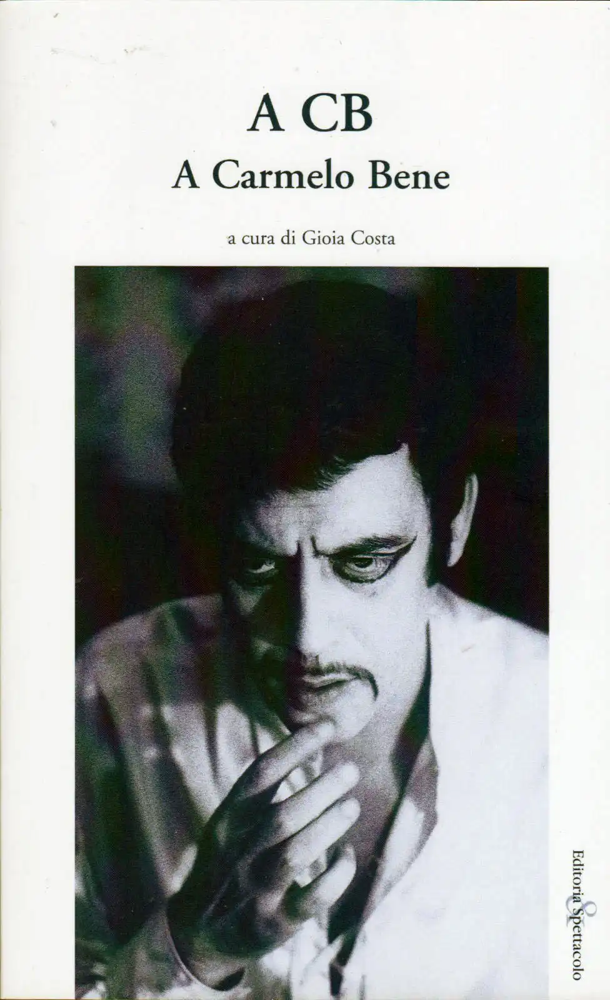

# A CB

*Quando non sai che dire e ti fa male il cuore, canticchi... 2003: Carmelo Bene è morto da nemmeno un anno e [Gioia Costa](https://www.gioiacosta.com/) raccoglie le testimonianze degli amici (e non) in un volume che esce per i tipi di Editoria e Spettacolo. C'è anche una mia poesiola.* 

<!-- more -->

---

I paragrafi che seguono sono tratti dall'introduzione di Gioia al volume. 

_A CB sono parole nate quando la voce di Carmelo Bene si è spenta, nel marzo scorso. Dei suoi amici, di coloro che con lui hanno pensato le scene e le luci, le musiche e l’immagine della sua arte. Molti, che gli sono stati vicini, mancano. Nel 2003, l’invito della fondazione l’Immemoriale a pubblicare questi testi ne ha fatti nascere di nuovi, cui si sono aggiunte, offerte dai fotografi, le immagini. A coloro che hanno dato una diversa immagine di Carmelo Bene va il nostro ringraziamento, e anche alla fondazione Romaeuropa, che ha accolto l’idea di rendere sulla sua rivista un omaggio diverso a CB. Diverso perché la maschera pubblica tanta ombra dava alla sua limpidissima visione, alla sua lucente opera, alla sua voce struggente, a quel gusto di vivere appartato fra l’edera, gli angeli di gesso del Bernini, i broccati, gli argenti, i cristalli delle sue lunghe notti._

_Carmelo Bene era turco come i tramonti sul Bosforo, senza cuore come chi lo ha maciullato. Ma era anche amorevole, fedele, generoso. E tutto questo, come ha scritto Jean-Paul Manganaro, di lui non si sa. Tutto questo è deposto nelle parole che sceglieva, nella perfezione delle scene, nella cura dei dettagli. In quella trama di letture, di conversazioni e di ostinata ricerca che solo chi ha lavorato accanto a lui, chi lo ha visto provare, chi con lui ha cenato o chi ha avuto la fortuna di tacere quando non capiva, aspettando di capire, solo loro sanno e possono dire. Carmelo non c’è più. Resta la sua casa. Restano registrazioni, video, film, immagini, scritti, fotografie, trasmissioni. Restano le sue cose, i bei libri letti e annotati, le lampade con le perline, i quadri di Klossowski, i costumi, i velluti doppi. Resta la sua idea del teatro, così in anticipo da non essere ancora compresa. E resta ciò che ha lasciato a ciascuno, che torna improvviso. Il fotografo Sandro Becchetti, dandomi la bella immagine di CB che è in queste pagine, mi ha detto: “Sa perché Carmelo amava incondizionatamente le donne? Me lo disse quel giorno: Perché sono la cosa vivente più vicina alla morte”. E in Laforgue, in Gozzano, in Leopardi, in Majakowskij, in Dante, in Shakespeare, in Collodi, in Camus, in Marlowe, in De Musset, in Cervantes, in Benelli, in Prévost, in Hölderlin, in Stazio, in Jarry, in Kleist, in Teofilo Folengo Carmelo Bene ha sempre cercato, nella loro paura di morire, la sua ragione di vivere._

<figure markdown>
  { width="500" }
  <figcaption>«A CB», a cura di Gioia Costa</figcaption>
</figure>

Con interventi di:

Jean-Paul Manganaro, Camille Dumoulié, Antonio Attisani, Sandro Lombardi, Romeo Castellucci, Achille Brugnini, Silvia Pasello, Mauro Contini, Doriano Fasoli, Elisabetta Sgarbi, Gaetano Giani-Luporini, Gioia Costa, Giancarlo Dotto, Michela Martini, Sonia Bergamasco, Renato Nicolini, Paolo Puppa, Piero Bellugi, Paolo Pelliccia, Tiziano Fario, Franco Cuomo, Rino Maenza, Enzo Moscato, Alfonso Santagata, Lisa Ferlazzo-Natoli, Davide Iodice, Davide Riboli, Luca Buoncristiano, Enrico Ghezzi, Maurizio Grande, Piergiorgio Giacchè.