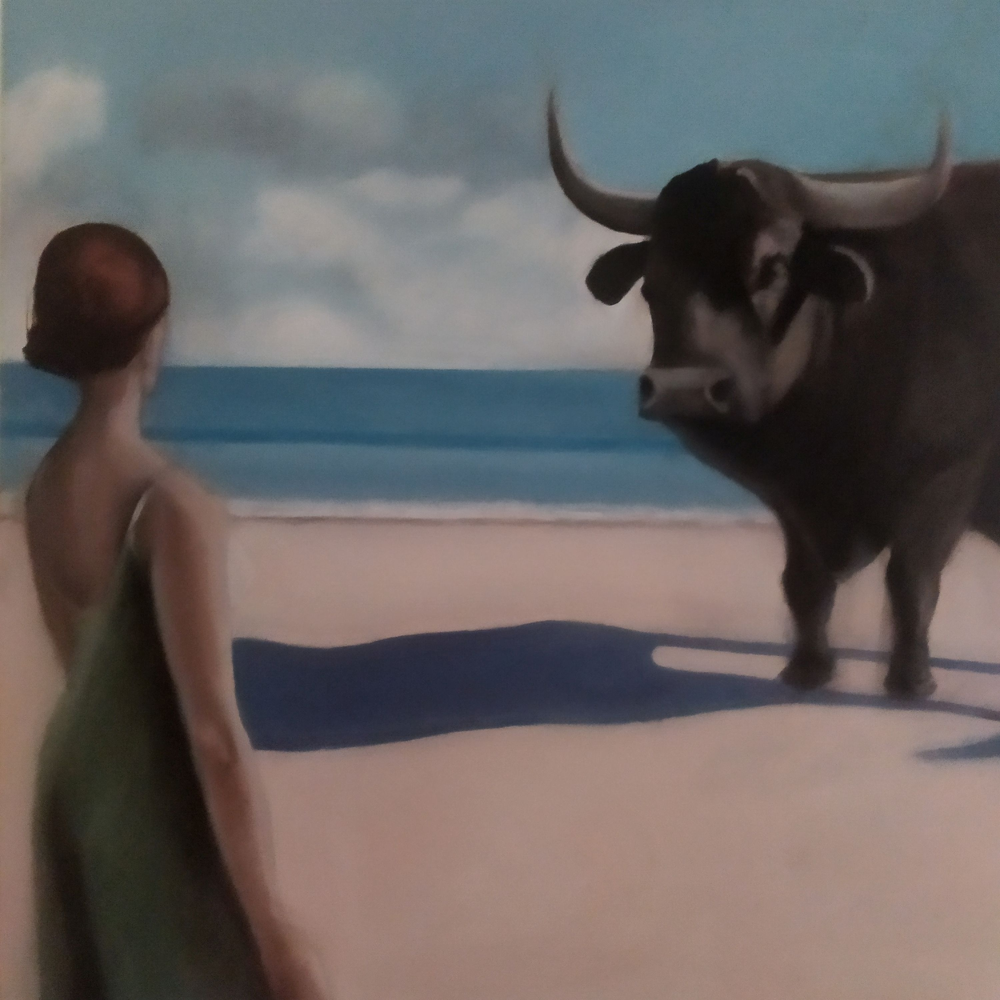
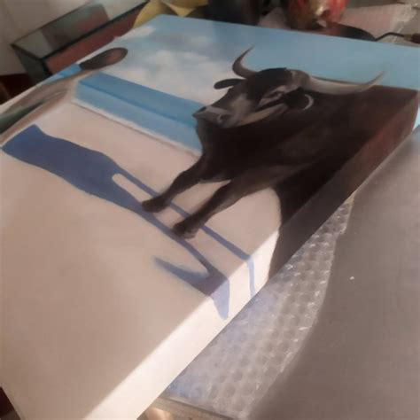

# A volte li comprano

*In questo mondo curioso, può succedere persino che qualcuno compri un mio quadro (anzi: mio e di Luciana Livi).* 

<!-- more -->

---

Luciana Livi è un'ottima amica e un'ottima artista. Un'artista di quelle vere, di quelle che dipingono tanto e molto bene, a differenza mia che non so neppure come si tiene una matita in mano.

Dall'anno scorso, abbiamo preso a collaborare: le mie macchine elaborano immagini e lei le dipinge, realizzando quadri veri da un pugno di pixel e uno spicciolo di corrente elettrica. Abbiamo un patto: io faccio quel che mi va e lei anche: quando qualcuna delle mie immagini la "tocca" più di altre, la dipinge, cambiandola come le pare.

Il patto funziona benissimo e ieri mi ha scritto che un collezionista ha acquistato un altro quadro della serie sul "Mito di Arianna", su cui abbiamo lavorato per mesi.

È una gioia e anche una sensazione strana: qualcosa che ho fatto (o forse dovrei dire "sognato", perché a fare davvero è Luciana) andrà a vivere nella casa di qualcuno che non conosco, di cui non so nulla. Per me, che sono un sociopatico, è perfetto. Ma è toccante sapere che qualcuno ha visto una tua opera e l'ha amata al punto di volerla acquistare.

Ora credo che Luciana prenderà a lavorare sulla mia Lady Macbeth, che ho aggiunto alla fine della galleria di questo post e a cui spero correggerà le dita che, nell'intenzione, dovevano reggere una tagliente scheggia di specchio. I miei minions hanno reso lo specchio troppo tagliente e diverse falangi della lady non sono più dove dovrebbero essere (gli errori sono la parte più divertente dell'arte generativa).

Non ho la più pallida idea di quando inizierà a lavorarci davvero, né di quando sarà pronto: fa parte del nostro patto perfetto. Ma se vi interessa, seguitela su [Instagram](https://www.instagram.com/lucianaliviartist/) o sui suoi account su [Saatchi-Art](https://www.saatchiart.com/en-it/lucianalivi) e [Singulart](https://www.singulart.com/it/artista/luciana-livi-17813).

- {data-gallery="avoltecomprano"}

- {data-gallery="avoltecomprano"}

- {data-gallery="avoltecomprano"}

- {data-gallery="avoltecomprano"}

