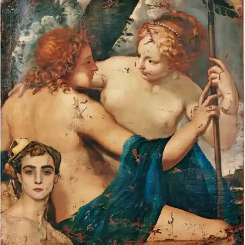

*Nel 2019, con Francesco Calcagnini e la produzione del Teatro Lirico di Cagliari, portammo in scena - insieme alla Scuola di Scenografia della Accademia di Belle Arti di Urbino, «Il campanello» di Gaetano Donizetti e questo fu il mio contributo per il programma di sala."*

<!-- more --> 

---

**MADAMA ROSA** 
*Che! La galoppa? Oh, dolce suon! Mi sento ringiovanir! Ballar con me vi piaccia una galoppa.*

**DON ANNIBALE** 
*Ohibò... Scusate... io deggio... E poi ballar non so...*

**MADAMA ROSA** 
*Pretesti!... Andiam…*

**DON ANNIBALE** 
*(Che imbroglio!...) Ma...*

**MADAMA ROSA** 
*Non ascolto... Galoppare io voglio.*

«Il campanello dello speziale» è una _farsa_. Tecnicamente, si definisce farsa un genere operistico molto diffuso a Venezia e Napoli, a cavallo tra la fine del XVIII e l’inizio del XIX secolo. Per gli addetti ai lavori musicali, il termine indica un’opera di carattere buffo, di un solo atto, a volte rappresentata insieme a dei balletti.

Ma c’è un’altra accezione di quel medesimo termine, nella
lingua parlata. Treccani ci ricorda che l’etimo è *farcitura, riempimento* e non solo:

_**farsa** s. f. [dal fr. farce, der. di farcir, che è il lat. farcire «riempire»] (...) Termine che in origine (nella forma fr. farce o in una corrispondente forma lat. mediev. farsa) indicò varî tipi di intervento popolaresco nelle cerimonie liturgiche, mediante interpolazione di testi e canti in volgare nei testi e nelle melodie della liturgia tradizionale (...) Oggi la parola (...) indica spreg. qualunque commedia, teatrale o cinematografica che, priva di valore artistico, si proponga il solo scopo di eccitare il facile riso di spettatori non raffinati (...)_

Dunque, nella lingua vissuta, *farsa* indica tanto lo spettacolaccio *accio accio accio*, quanto l’irruzione del volgare nella liturgia. E in un certo senso, nel lavoro librettistico di Donizetti (ricordiamo che de «Il campanello dello speziale» egli fu insieme compositore e librettista) il meccanismo buffo è innestato proprio da una boccaccesca profanità *de noantri* che si fa beffe dei sacri vincoli. E il riso che questa, come ogni altra farsa musicale e non, evoca nello spettatore non è il riso innocente del bambino, ma lo sghignazzo di chi sberleffa le disgrazie altrui per dimenticar le proprie. Forse non è un caso che l’autore compose l’opera negli anni più nefasti della propria vita quando, tra il 1835 e il 1837, perse entrambi i genitori, entrambe le figlie e la moglie Vírginia.

La verità (non troppo) segreta d’ogni teatro che non sia tragico è che il comico ha sempre un cuore triste, così come il dramma ha spesso un’origine esilarante. A ben vedere, nel canovaccio c’è assai poco di cui ridere: al già ricco Pistacchio non resta che il goder d’accumulare altra ricchezza, dopo che la sorte ha ripagato il suo desiderio di paternità con una moglie che porta in dote un baule di corna, una suocera *milf* e un amante della moglie che dorme sotto il suo stesso tetto.

<figure markdown>
  { width="500" }
  <figcaption>Anselmo Bucci, Autoritratto su tela antica del Padovanino</figcaption>
</figure>

Se non si trattasse d’una farsa, potrebbe essere un compendio dei temi trattati da Sade, Focault e Klossowski. Questo però ci porterebbe oltre il limitare di queste pagine... Più del ridere e men che meno del domandarsi di cosa si ride, vale ascoltar la musica.

*La galoppa? Oh, dolce suon! Mi sento ringiovanir!*

---

*Il programma completo, con gli interventi critici di Rossano Baronciani e altri autori e i disegni di Francesco Calcagnini, è [scaricabile da qui](PDF/CampanelloCagliari.pdf).*