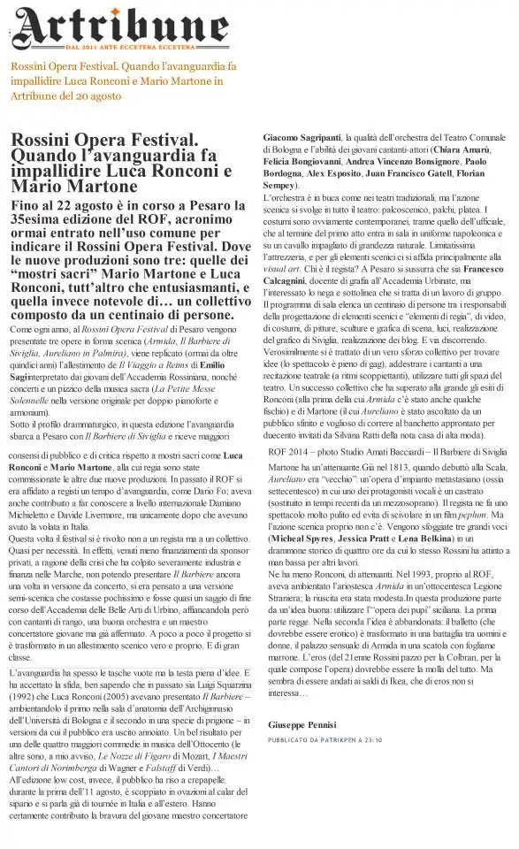

*Archivio dello spettacolo «Il Barbiere di Siviglia», realizzato per il Rossini Opera Festival (Pesaro, 2014).*

<!-- more --> 

---

{data-gallery="barbiere"}

Nel 2014 insegnavo "Applicazioni Digitali per l'Arte" e "Linguaggi Multimediali" alla Accademia di Belle Arti di Urbino e l'istituto venne contattato dal Rossini Opera Festival di Pesaro per la realizzazione di un allestimento de _Il Barbiere di Siviglia_ a cura dei nostri studenti. Francesco Calcagnini coordinò la realizzazione di regia e scene e io quella di tutti gli interventi multimediali in _videomapping_, mentre la direzione musicale fu affidata al Maestro Giacomo Sagripanti. Questi i personaggi e gli interpreti della prima:

- Il Conte d’Almaviva | Juan Francisco Gatell
- Bartolo | Paolo Bordogna
- Rosina | Chiara Amarù
- Figaro | Florian Sempey
- Basilio | Alex Esposito
- Berta | Felicia Bongiovanni
- Fiorello / Ufficiale | Andrea Vincenzo Bonsignore
- Ambrogio | Alberto Pancrazi
- Coro San Carlo di Pesaro
- Maestro del Coro | Salvatore Francavilla
- Orchestra del Teatro Comunale di Bologna

Ricordo quell'esperienza come un divertente (a volte) e faticosissimo (sempre) putiferio: il videomapping non era ancora troppo diffuso sulle scene e l'idea di lavorare con la luce su platea e ordini, oltre che in palcoscenico, ebbe molto successo, ma la sua realizzazione ci fece sudare parecchio. Fu un successo con eco internazionale; la rassegna stampa è [qui](PDF/barbiererassegnato2014.pdf).

Conservo le foto di questa pagina per affetto, ma archivi ben più corposi si trovano sulla [pagina dedicata del ROF](https://www.rossinioperafestival.it/archivio/anno-2014/il-barbiere-di-siviglia/) e su quella della [Scuola di Scenografia ABA Urbino](https://www.facebook.com/scuoladiscenografiaurbino/photos).

Nel 2016, con un nuovo cast, la mia co-regia e un allestimento leggermente diverso, lo spettacolo fu prodotto e distribuito dalla Rete Lirica delle Marche.

- {data-gallery="barbiere"}

- {data-gallery="barbiere"}

- {data-gallery="barbiere"}

- {data-gallery="barbiere"}

- {data-gallery="barbiere"}

- {data-gallery="barbiere"}

- {data-gallery="barbiere"}

- {data-gallery="barbiere"}

- {data-gallery="barbiere"}

- {data-gallery="barbiere"}

- {data-gallery="barbiere"}

- {data-gallery="barbiere"}

- {data-gallery="barbiere"}

- {data-gallery="barbiere"}

- {data-gallery="barbiere"}

- {data-gallery="barbiere"}

- {data-gallery="barbiere"}

- {data-gallery="barbiere"}

- {data-gallery="barbiere"}

- {data-gallery="barbiere"}

- {data-gallery="barbiere"}

- {data-gallery="barbiere"}

- {data-gallery="barbiere"}

- {data-gallery="barbiere"}

- {data-gallery="barbiere"}

- {data-gallery="barbiere"}

- {data-gallery="barbiere"}

- {data-gallery="barbiere"}

- {data-gallery="barbiere"}

- {data-gallery="barbiere"}

- {data-gallery="barbiere"}

- {data-gallery="barbiere"}

- {data-gallery="barbiere"}

- {data-gallery="barbiere"}

- {data-gallery="barbiere"}

- {data-gallery="barbiere"}

- {data-gallery="barbiere"}

- {data-gallery="barbiere"}

- {data-gallery="barbiere"}

- {data-gallery="barbiere"}

- {data-gallery="barbiere"}

- {data-gallery="barbiere"}

- {data-gallery="barbiere"}

- {data-gallery="barbiere"}

- {data-gallery="barbiere"}

- {data-gallery="barbiere"}

- {data-gallery="barbiere"}

- {data-gallery="barbiere"}

- {data-gallery="barbiere"}

