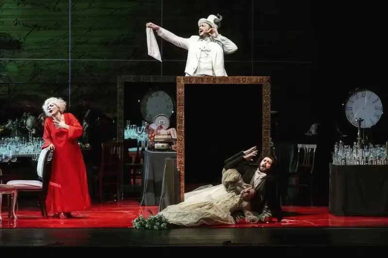
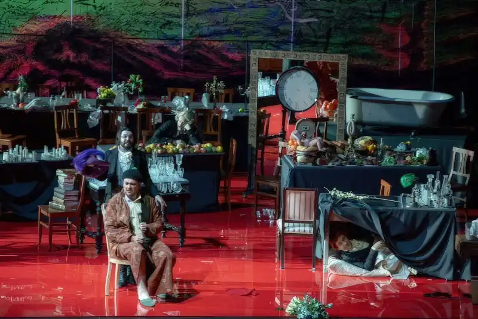
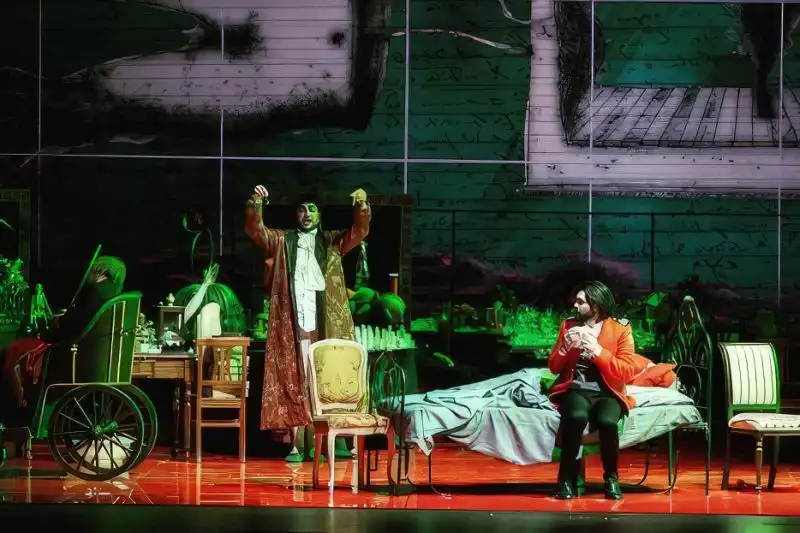
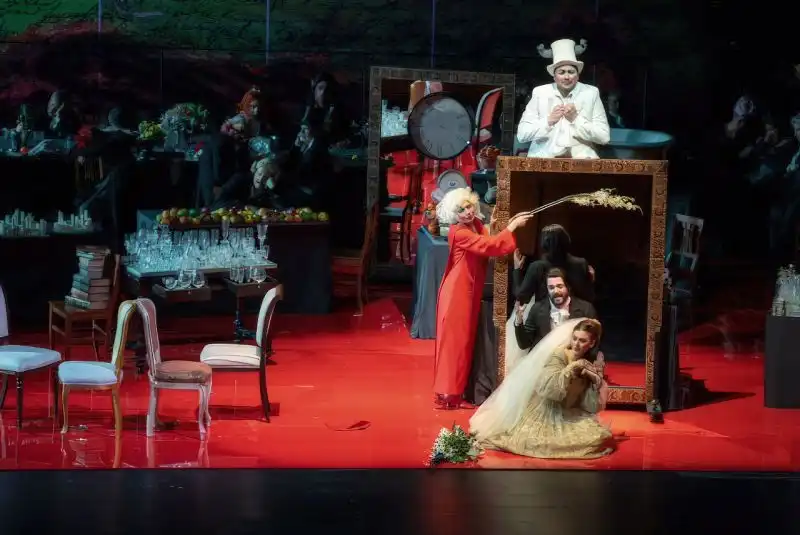
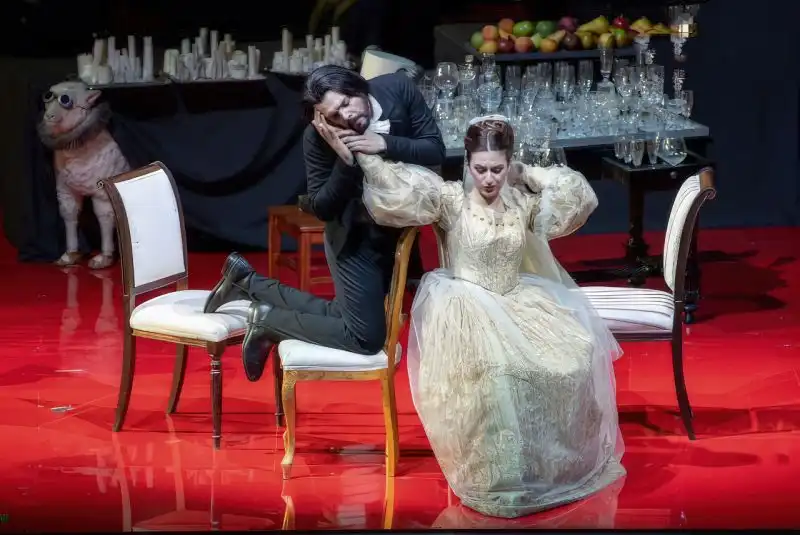

*Archivio dell'omonimo spettacolo realizzato per il Teatro Lirico di Cagliari (2019).*

<!-- more --> 

---

_La cambiale di matrimonio_ del 2019 fu [prodotta dal Rossini Opera Festival in collaborazione con il Teatro Lirico di Cagliari](cambiale.md) e, trattandosi di un atto unico e breve, a Cagliari si optò per aggiungere alla serata anche _Il Campanello_ di Gaetano Donizetti, un altro atto unico, breve e divertentissimo.

Firmai di nuovo la regia insieme a Francesco Calcagnini, mentre la direzione musicale fu del Maestro Alvise Casellati e questo è l'elenco dei personaggi e interpreti della prima:

- Serafina | Claudia Muschio/Federica Sardella
- Madama Rosa | Martina Serra
- Don Annibale Pistacchio | Vincenzo Taormina/Nicolò Donini
- Enrico | Luca Micheletti/Andrea Vincenzo Bonsignore
- Spiridione | Matteo Falcier
- Orchesta e coro del Teatro Lirico di Cagliari

Scrissi anche un breve intervento per il programma di sala che potete [leggere qui](ballarconmevipiaccia.md).

- {data-gallery="campanello"}

- {data-gallery="campanello"}

- {data-gallery="campanello"}

- {data-gallery="campanello"}

- {data-gallery="campanello"}

- {data-gallery="campanello"}

