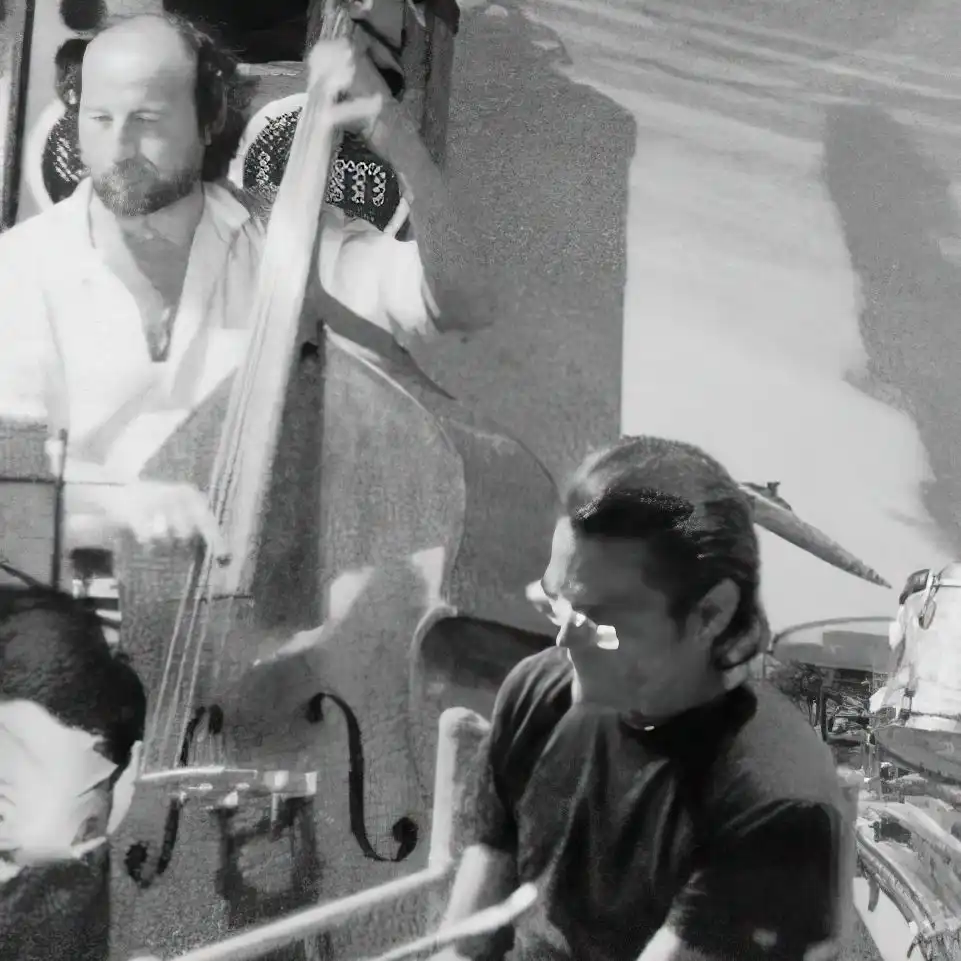
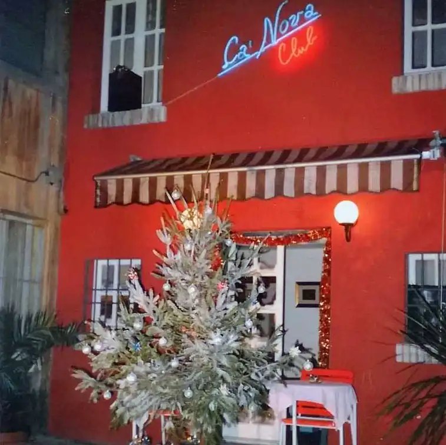
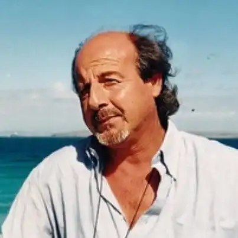

*Quella sera, c'ero.*

<!-- more --> 

---

La sera che Giorgio suonò con Chet Baker, a Pesaro, c'ero davvero.

Niente palchi, social, adunate: Il Ca' Nova era un posticino agli inizi di via San Francesco, nella traversa di via delle Zucchette, dove in tre s'era già una folla. La notizia circolò tra amici, qualche giorno prima e fino all'ultimo ero convinto fosse uno scherzo: Chet Baker a Pesaro. Niente manifesti, niente articoli e qualcuno che chiedeva 'Chi è Chet Baker?". 

Ma quella sera Chet Baker era lì e Giorgio suonò con lui. Qualcuno se lo ricorderà: Baker era molto stanco (morì di lì a un anno o due) e dopo poco a suonare la tromba non ce la fece più. Si scusò coi quattro gatti in sala, si sedette e prese il microfono nelle mani a coppa, per fare con un fil di voce quello che non poteva più fare con lo strumento. Giorgio e il resto del gruppo più che suonare con lui, lo avvolsero in una protettiva rete di note. Amore purissimo in forma di cool jazz.

In quegli anni, nel locale di Giuliano, ci passarono musicisti del calibro di Chet Baker, Enrico Pierannunzi, Lee Konitz, Elmer Gill e Mc Coy Tyner. L'unico a scriverne fu Paolo Angeletti. Qualche tempo dopo, a casa di Carmelo Bene, quando sapemmo della morte di Baker, io gli raccontai del concerto di Pesaro e lui mi disse che negli anni romani di Baker si erano visti spesso e un paio di volte Baker aveva dormito (leggi: era svenuto) sul divano di casa sua.

Ci sono ricordi che ti restano dentro senza sbiadire. Uno dei miei è quello di quella sera. Io c'ero e se prendi a ripetere questa frase troppo spesso, significa che sei vecchio, ti chiedi dove diavolo sono finiti tutti, ma non hai voglia di risponderti.
Nessuna delle foto è mia: il primo piano di Giorgio è su tutta la cronaca locale di oggi e le altre le ho rubate dal [sito di "Pesaro Segreta"](https://pesarosegreta.wordpress.com/2020/12/31/ca-nova/) dove ci sono un sacco di altri scatti del Ca' Nova e di quello che ci succedeva.

- {data-gallery="chetbaker-pesaro"}

- {data-gallery="chetbaker-pesaro"}

- {data-gallery="chetbaker-pesaro"}

