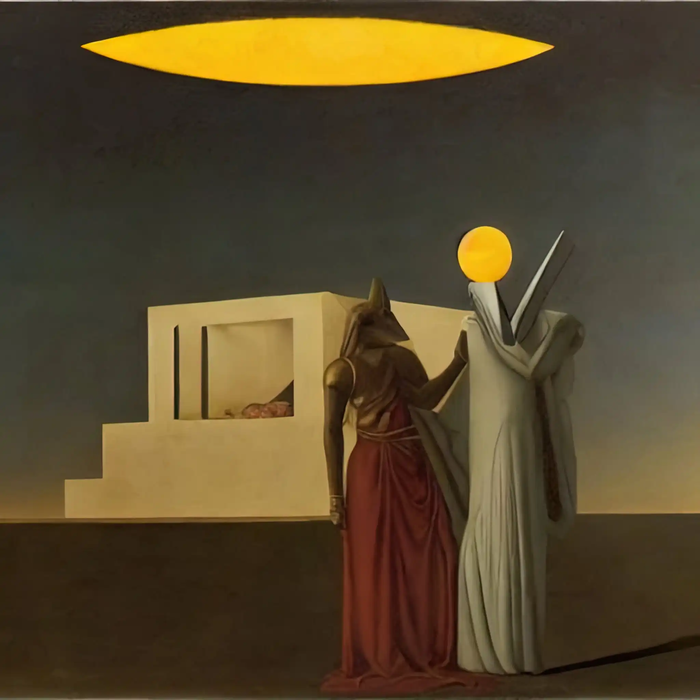
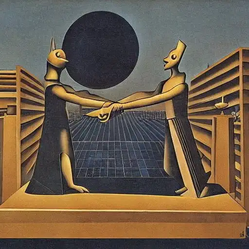
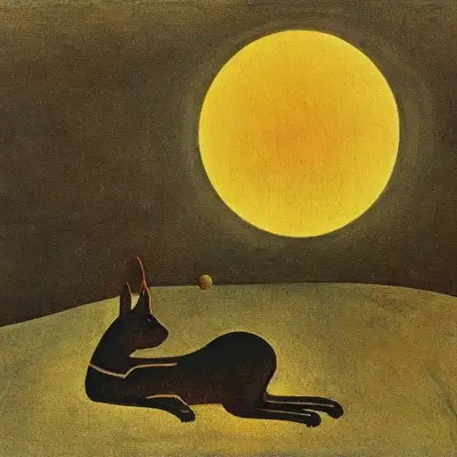
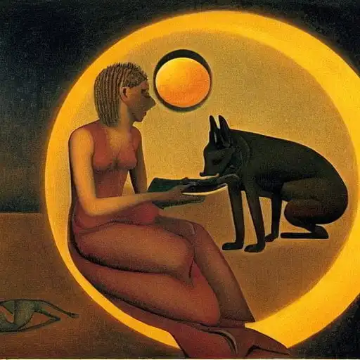
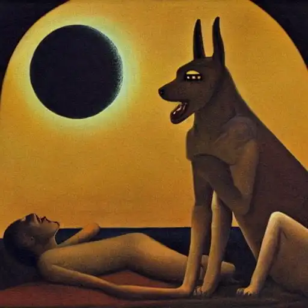
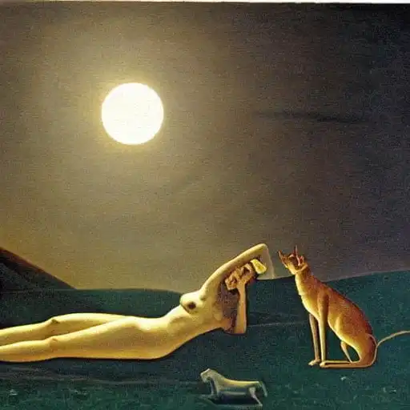
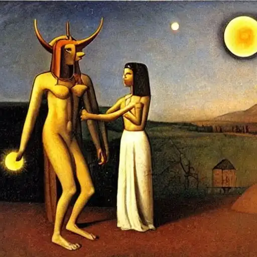
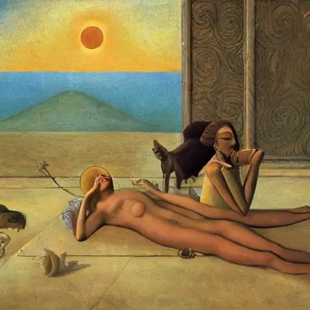
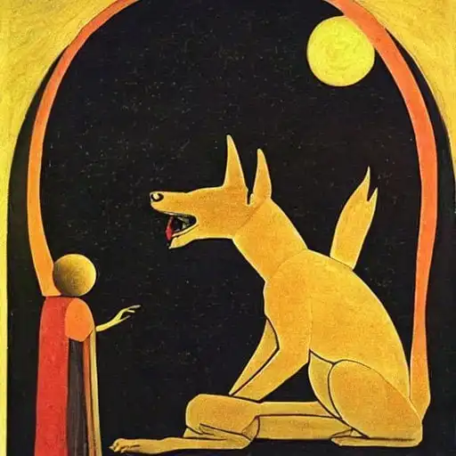
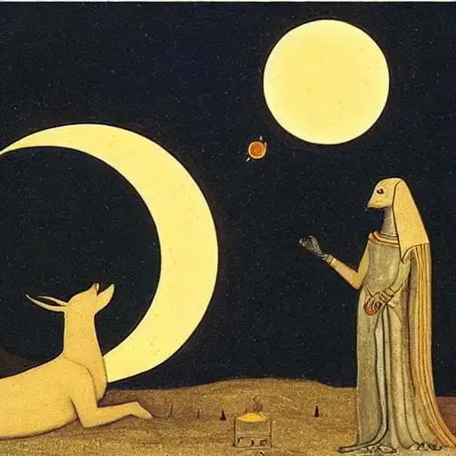

*Un ciclo di opere ispirate al mito di Anubis, create con Stable Diffusion e varie tecniche di pittura digitale, durante l'eclissi solare del 25 ottobre 2022.*

<!-- more --> 

---

- {data-gallery="eclissi"}

- {data-gallery="eclissi"}

- {data-gallery="eclissi"}

- {data-gallery="eclissi"}

- {data-gallery="eclissi"}

- {data-gallery="eclissi"}

- {data-gallery="eclissi"}

- {data-gallery="eclissi"}

- {data-gallery="eclissi"}

- {data-gallery="eclissi"}

