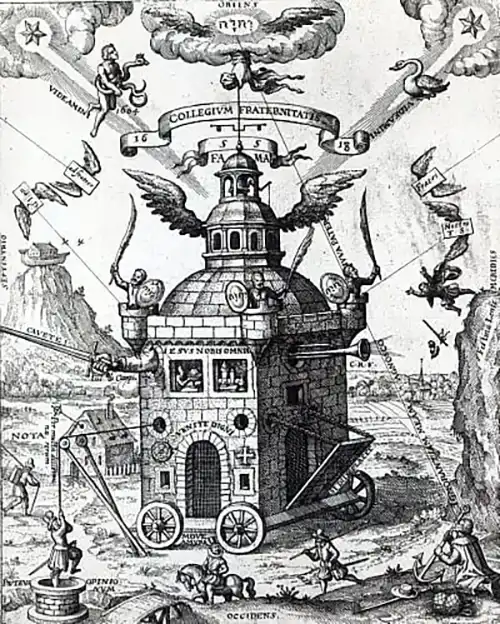

# Fate Luce!

*Nel 2016 avrei dovuto firmare con Francesco Calcagnini la regia de «Il Flauto Magico», ma le cose non andarono come previsto a causa di un incidente che mi costrinse a letto per più di sei mesi. Minima consolazione: questo scritto fu pubblicato sul programma di sala.*

<!-- more -->

---

*Grazie alla potenza della musica*  
*camminiamo lieti attraverso*  
*l’oscura notte della morte.*

Il 29 settembre 1791, Wolfgang Amadeus Mozart annotò su uno dei propri registri il raggiunto compimento di *Zauberlöte* (Flauto Magico), opera in due atti su libretto di Emanuel Schikaneder. Il giorno seguente ebbe luogo la prima rappresentazione assoluta al *Theater auf der Wieden* di Vienna, di proprietà di Schikaneder stesso che interpretò anche il ruolo di Papageno con la direzione musicale del compositore.

Non sappiamo molto dell’allestimento scenico che presumiamo realizzato dagli stessi Schikaneder e Mozart, probabilmente insieme al professore di mineralogia Carl Ludwig Giesecke, assoldato per l’occasione come direttore di scena. Sono note invece, le fortune cui il lavoro andò incontro sin dalle sue prime repliche. Mozart morì il 5 dicembre 1791. Nel novembre del 1792 l’opera aveva già superato la soglia delle cento rappresentazioni e divenne rapidamente una delle composizioni più celebri – se non la più celebre in assoluto – in Austria e Germania. Pochi anni più tardi se ne interessò persino Goethe che giunse a ipotizzare la stesura di un nuovo libretto per una possibile continuazione.

Il successo iniziato duecentoventicinque anni fa non accenna a diminuire: negli ultimi vent’anni *Zauberlöte* è stata costantemente tra le cinque opere più rappresentate al mondo. Tanta popolarità appare quasi inspiegabile ad una prima lettura della sinossi. Due giovani –
innamoratisi per procura l’uno dell’altra - sono chiamati ad affrontare una serie di prove iniziatiche prima di potersi congiungere. Ancora ignorano che la prima vera prova è il giungere alle prove. Per questo si rincorreranno attraverso paesaggi esotici ed atmosfere fantastiche, incrociando i loro destini con quelli di un grande Serpente, un Uomo-Uccello, tre Dame, una Regina della Notte, un Sacerdote Mago, tre Piccoli Geni, un Servo Malvagio ed una Giovane Vecchia.

Le avventure e le disavventure dei corpi e degli spiriti dei due protagonisti creano una trama talmente fitta e complessa che allo spettatore conviene ripudiare il prima possibile l’ordito della logica. Il Duplice la fa da padrone e Bene e Male si ribaltano senza tregua l’uno sull’altro, in un complicato amplesso camuffato da lezione morale di stampo illuminista.

Ma la fragilità del costrutto narrativo dona all’opera la leggerezza richiesta dalle ali della composizione musicale. Se fosse architettura, *Zauberlöte* potrebbe essere quel bislacco *Collegium Fraternitatis* raffigurato da Teophilus Schweighardt Constantiens nel 1618 e
celebrato qualche secolo più tardi da Hayao Miyazaki ne *Il Castello errante di Howl*: uno scombiccherato edificio ineluttabilmente condannato al crollo da incontrovertibili leggi fisiche che però… vola.

<figure markdown>
  { width="500" }
  <figcaption>Teophilus Schweighardt Constantiens, Collegium Fraternitatis</figcaption>
</figure>

Nel lavoro di Mozart e Schikaneder confluiscono principi illuministici, morale massonica, sapienze alchemiche, fascino esotico di un Egitto di fantasia, tradizione popolaresca e gusto per la fiaba. Qualsiasi lettura prediliga uno di questi aspetti sugli altri o comunque abdichi al tentativo - sempre impossibile - di testimoniarli tutti insieme, non potrà che restituire il profilo piatto di un solido complesso.

Un cilindro visto dall’alto è un cerchio, una piramide vista dall’alto è un quadrato con un punto all’incrocio delle diagonali. Né il cilindro, né la piramide possono essere colti dall’occhio nella loro interezza, ma se li facciamo ruotare o siamo noi a percorrerne il perimetro, comprendiamo subito che le facce di cui si compongono sono assai più d'una.

Le fughe prospettiche dei tanti ambienti di questo strambo ediicio che è _Zauberlöte_ non obbediscono ad alcuna geometria euclidea. Le loro regole ricordano piuttosto quelle di incomprensibili principi quantistici che ipotizzano l’occorrenza contemporanea di molti universi e dimensioni nel medesimo istante. E questa contemporanea occorrenza di molteplici signicanti protegge e favorisce la fuga continua di ogni significato. Mai come in _Zauberlöte_ il signicato è un sasso in bocca al significante.

Scorrendo le tavole realizzate dagli studenti della Scuola di Scenografia della Accademia di Belle Arti di Urbino per l’allestimento prodotto dalla Rete Lirica delle Marche non si attraversano i quadri e le scene che di norma scandiscono lo sviluppo di una azione teatrale. Si assiste piuttosto alla declinazione potenzialmente infinita di un ambiente indefinito, ideato per accogliere tanto una fiaba per bambini, quanto un tempio massonico o le proiezioni dei primi turbamenti di una inattesa età puberale. *ZuHilfe! ZuHilfe!*

Tutto può davvero essere qui e ora: scienza, magia, religione, morale, filosofia, leggi di Natura, dell’Uomo e di Dio. Queste scene sono concepite come dispositivo al tempo stesso generatore e contenitore di hic et nunc. Vale a dire: Teatro. Le loro luci e le loro oscurità rispecchiano tutte le contraddizioni di due autori che, non appena accese le fiaccole dei Lumi, paiono rimpiangere un po' la penombra simbolico-esoterica di cui necessita ogni la vita di ogni Spirito.

---

*L'opera fu prodotta dalla Rete Lirica delle Marche e andò in scena con la direzione di Gaetano D’Espinosa, la regia di Francesco Calcagnini e scene e costumi ideati e progettati dalla Scuola di Scenografia della Accademia di Belle Arti di Urbino. Dopo il debutto al Teatro dell'Aquila di Fermo, lo spettacolo fu portato al Teatro della Fortuna di Fano e al Ventidio Basso di Ascoli.*