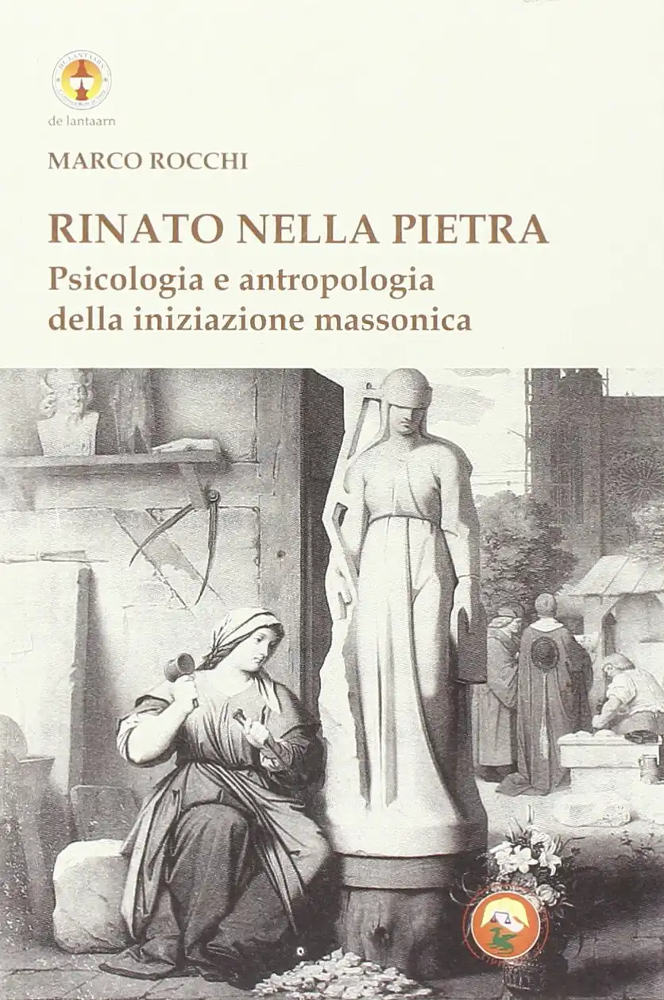

*Un breve saggio, pubblicato in appendice al volume di Marco Rocchi «Rinato nella pietra, Psicologia e antropologia della iniziazione massonica», edito da Tipheret nel 2014.*

<!-- more --> 

-  Un lavoro nato in forma di tavola di loggia che — grazie alla cortesia dell'amico Marco Rocchi che l'ha ritenuto abbastanza buono da includerlo nel suo ottimo volume sulla iniziazione massonica — è stato il mio primo scritto di natura libero-muratoria ad arrivare alle stampe.     Potete leggerlo con un [clic qui](PDF/Da_Giasone_a_Cenerentola.pdf) oppure sul mio [*account* di Academia.edu](https://www.academia.edu/33459029/Da_Giasone_a_Cenerentola).     Il volume di Marco, edito per i tipi di Tipheret (ISBN-10: 8864961712), è [disponibile via Amazon](https://www.amazon.it/dp/8864961712).

- <figure markdown>
  [{ width="300" }](https://www.amazon.it/dp/8864961712)
  </figure>

