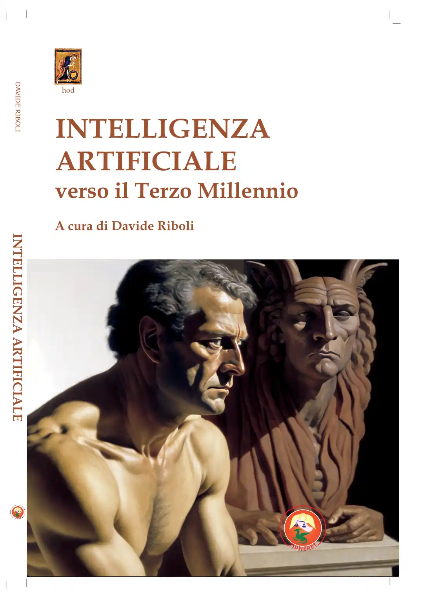

*Gli atti del convegno svoltosi a Pesaro sabato 12 ottobre 2024, editi da Tipheret nello stesso anno.*

<!-- more --> 

  - <figure markdown>
  { width="300" }
  </figure>

-  I volume raccoglie gli atti del convegno intitolato *Intelligenza Artificiale verso il Terzo Millennio*, organizzato dalla associazione “Non Ti Scordar Di Me” col patrocinio della
Regione Marche, del Comune di Pesaro e dell’Università degli Studi “Carlo Bo” di Urbino.  Il convegno si è tenuto il 12 ottobre 2024, presso l’Hotel Charlie di Pesaro e ha visto la partecipazione
di Alessandro Cecchi Paone, giornalista e divulgatore scientifico; Michele Giannasi e Nico Angelone, artisti; Gianfranco Pacchioni, professore ordinario di Chimica dei Materiali presso l’Università “Milano Bicocca” e Accademico dei Lincei; Francesco Valagussa, professore ordinario di Estetica presso l’Università “Vita-Salute San Raffaele” di Milano e me, in qualità di professore ordinario di Applicazioni Digitali per l’Arte presso l’Accademia di Belle Arti “Mario Sironi” di Sassari.  Potete leggere il mio contributo con un [clic qui](PDF/DR-IA3K.pdf).   Il volume, edito per i tipi di Tipheret (ISBN 978-88-6496-826-1), può essere [richiesto direttamente all'editore](https://www.gebonanno.com/) oppure ordinato tra qualche tempo via Amazon.

