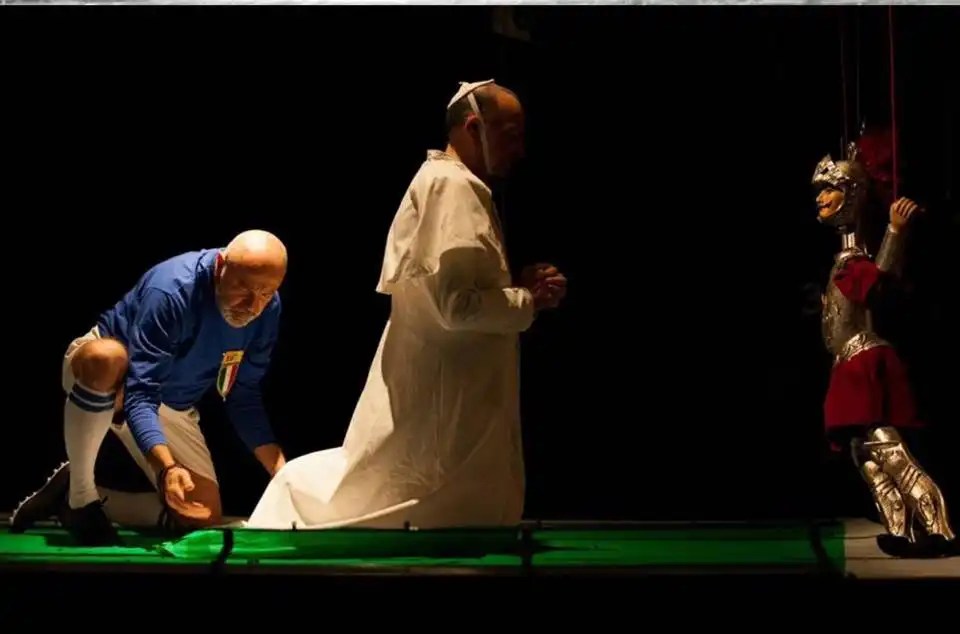

*Archivio dello spettacolo "Impreparati (titolo provvisorio)" realizzato in occasione del quarantennale della morte di Aldo Moro (Pesaro, 2018).*

<!-- more -->

---

Il 9 maggio del 2018, in occasione dei quarant'anni dalla scomparsa di Aldo Moro, è andato in scena al Teatro Rossini di Pesaro uno spettacolo realizzato dalla Scuola di Scenografia della Accademia di Belle Arti di Urbino, con la co-produzione di AMAT Marche per la rassegna TeatrOltre.

Il testo, molto liberamente tratto da «L'affaire Moro» di Leonardo Sciascia, lo scrissi insieme a Francesco Calcagnini (con cui curai anche l'allestimento) e Rossano Baronciani.

Sia il testo completo che il programma di sala sono [scaricabili qui](granvarietadelnulla.md). 

- {data-gallery="impreparati"}

- {data-gallery="impreparati"}

- {data-gallery="impreparati"}

- {data-gallery="impreparati"}

- {data-gallery="impreparati"}

- {data-gallery="impreparati"}

- {data-gallery="impreparati"}

- {data-gallery="impreparati"}

