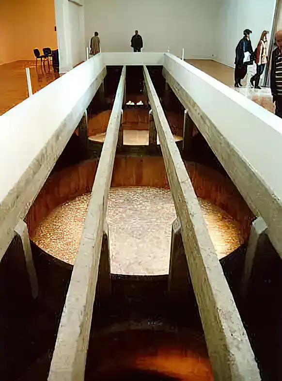

# Katakripsi [Biennale di Venezia 1997]

*Nel 1997 realizzai, insieme a [Leonardo Sonnoli](https://www.sonnoli.com/?page_id=2), una installazione multimediale al [Padiglione di Grecia della Biennale di Venezia](https://europeforvisitors.com/venice/articles/looking_back_on_biennale.htm), per conto dell’artista [Dimitri Alithinos](https://www.torart.com/it-it/dimitris-alithinos.aspx).* 

<!-- more -->

---

Dimitri Alithinos aveva fatto scavare una fossa sotto il padiglione, in cui erano state poi alloggiate diverse grandi vasche riempite di un materiale metallico simile all’oro liquido. Alla fine della Biennale, il pavimento è stato ricostruito, ma l’opera non è stata spostata (almeno da quello che so) e questo ne fa l’unica installazione permenente della Biennale.

<figure markdown>
  { width="500" }
  <figcaption>Katakripsi di Dimitri Alithinos</figcaption>
</figure>

Alithinos, prima del 1997, aveva creato altre 71 opere in diversi paesi del mondo, che erano state ugualmente celate.

L’installazione multimediale creata da me e Sonnoli permetteva agli spettatori di fruire delle opere precedenti attraverso una particolare interfaccia, studiata per non infrangere quella segretezza del nascondimento che delle opere era parte integrante.

Costruimmo tutto con [mTropolis](https://en.wikipedia.org/wiki/MTropolis), un software di composizione multimediale che allora era in grande anticipo sui tempi ma che oggi non è più supportato e quindi non me ne rimane alcuna immagine. Anche se non ho ancora perso tutte le speranze di riuscire, un giorno, a disassemblare uno dei CD-Rom che mi è rimasto.