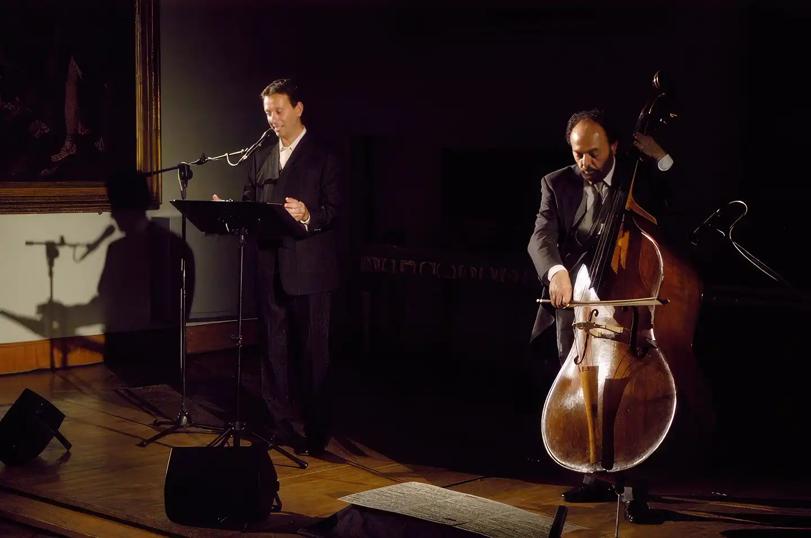

# Il Mal de' Fiori e i friggitelli

*Il 12 settembre 2004 tenni un concerto con Fernando Grillo presso la Sala Pietro da Cortona del Palazzo dei Conservatori, al Campidoglio di Roma. L'evento inaugurava la terza edizione del [Festival Esplorazioni](http://www.e-azioni.net/mambo/index.php?option=content&task=view&id=162&Itemid=96), creato e diretto da Gioia Costa ed era dedicato alla memoria di Carmelo Bene, cui eravamo tutti e tre legatissimi.*

<!-- more --> 

---

<figure markdown>
  { width="500" }
  <figcaption>Davide Riboli e Fernando Grillo, foto di Tommaso Le Pera (Roma, 2004)</figcaption>
</figure>

Lessi diverse liriche tratte dall'ultimo libro che Carmelo aveva dato alle stampe nel 2000 e che aveva vinto il Premio Montale. Con Fernando s'era deciso di non fare prove, ma di improvvisare liberamente e la serata fu indimenticabile. 

Dopo quell'esperienza e la scoperta del comune interesse verso l'Alchimia diventammo molto amici e per qualche tempo progettammo di affrontare insieme un'esecuzione della [Atalanta Fugiens](https://furnaceandfugue.org/). La sua perdita, dopo quelle di Maurizio Grande e Carmelo Bene, è stata un grande dolore.

Sempre nel 2004, preparai alla lettura di quelle stesse liriche [Isa Danieli](../../../../PDF/Isa.pdf). Non avevamo mai avuto occasione di conoscerci prima e fu un'esperienza molto bella. Ci mise in contatto Rodolfo Di Giammarco e andò a finire che più che provare si passava il tempo a raccontarci storie su Carmelo Bene ed Eduardo De Filippo. Poi si metteva a cucinare, perché ci teneva moltissimo ad essere lei a preparare la cena, e preparava spesso i friggitelli, sapendo quanto mi piacevano. Erano buonissimi e li mangiavamo sul suo terrazzo che aveva una magnifica vista su Napoli, chiacchierando tanto di nulla.