*Nel 2021 ho avuto il piacere di collaborare con Monica Miniucchi al suo spettacolo di danza contemporanea "Marasma".*

<!-- more --> 

---

Non avevo mai lavorato a uno spettacolo di danza, il che è abbastanza curioso, se si considera che con Monica siamo amici da tanti di quegli anni che non è più il caso di contarli. Monica mi ha chiesto di preparare parte della colonna sonora del suo spettacolo e di supervisionare la produzione dei video creati da Lorenza Di Gioia ed Emanuele Rebecchini. 

<figure markdown>
  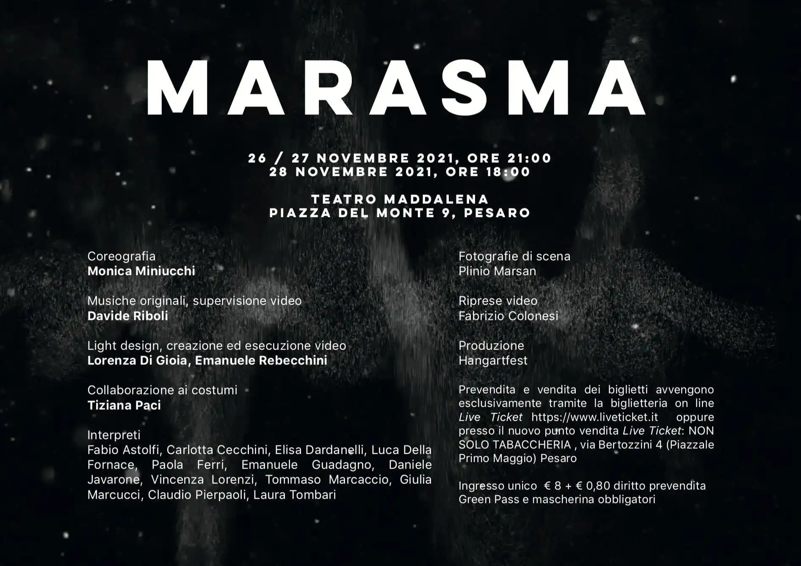{ width="500" }
  <figcaption>Marasma, manifesto 2021</figcaption>
</figure>

"Daffodil Green" è un drone che abbiamo usato in molti diversi momenti del lavoro, concepito in modo da poter essere lanciato in _fade-in_ e chiuso in _fade-out_ in qualsiasi momento del suo sviluppo. Questo ha offerto un'esperienza d'ascolto leggermente diversa per ogni ritorno del brano.

<iframe src='https://www.youtube.com/embed//AoKO34GDUjI' frameborder='0' allowfullscreen></iframe>

---

"Les Faux Souvenirs" e "Whisper Sync" sono due composizioni realizzate con voci [ASMR (Autonomous Sensory Meridian Response)](https://en.wikipedia.org/wiki/ASMR), progettate per sfruttare al meglio l'importante riverbero naturale della [Chiesa della Maddalena di Pesaro](https://www.hangartfest.it/teatro-maddalena)  che è il teatro che ha ospitato la prima.

<iframe src='https://www.youtube.com/embed//rnDydwATX6Y' frameborder='0' allowfullscreen></iframe>

---

<iframe src='https://www.youtube.com/embed//CHvdk3NsiG0' frameborder='0' allowfullscreen></iframe>

---

"Shika No Kyōfu" è il pezzo più complesso, realizzato seguendo (vagamente) alcuni canoni della musica giapponese.

<iframe src='https://www.youtube.com/embed//a-HTDy29cXs' frameborder='0' allowfullscreen></iframe>

---

Tutte le foto di scena sono di Plinio Marsan (Pesaro, 2021/11/26).

- 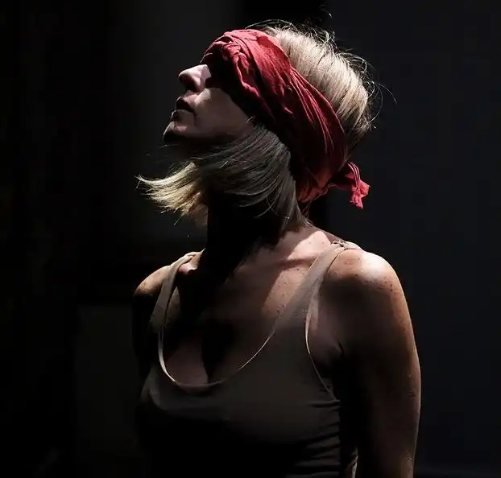{data-gallery="marasma"}

- 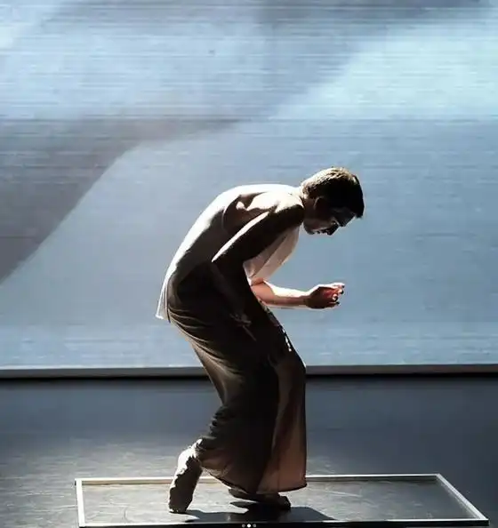{data-gallery="marasma"}

- 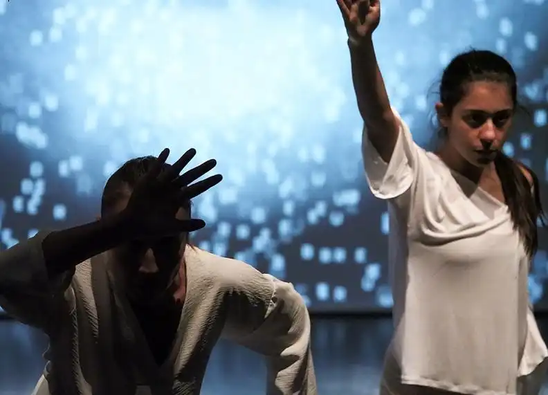{data-gallery="marasma"}

- 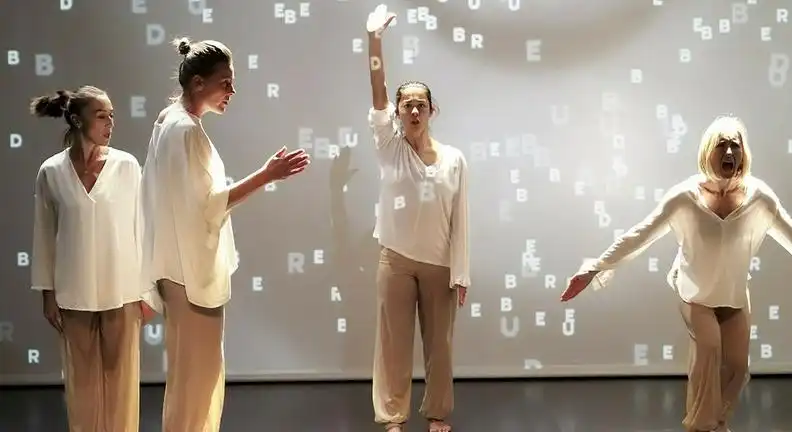{data-gallery="marasma"}

- 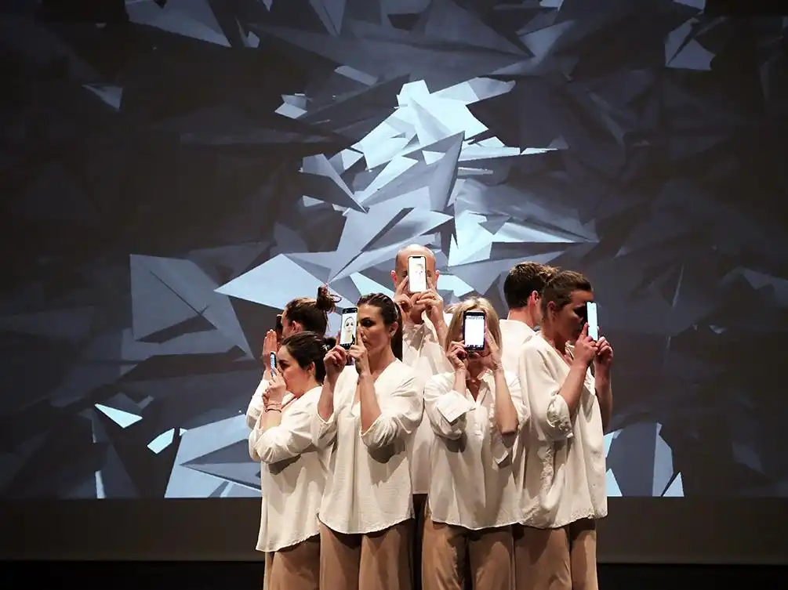{data-gallery="marasma"}

- 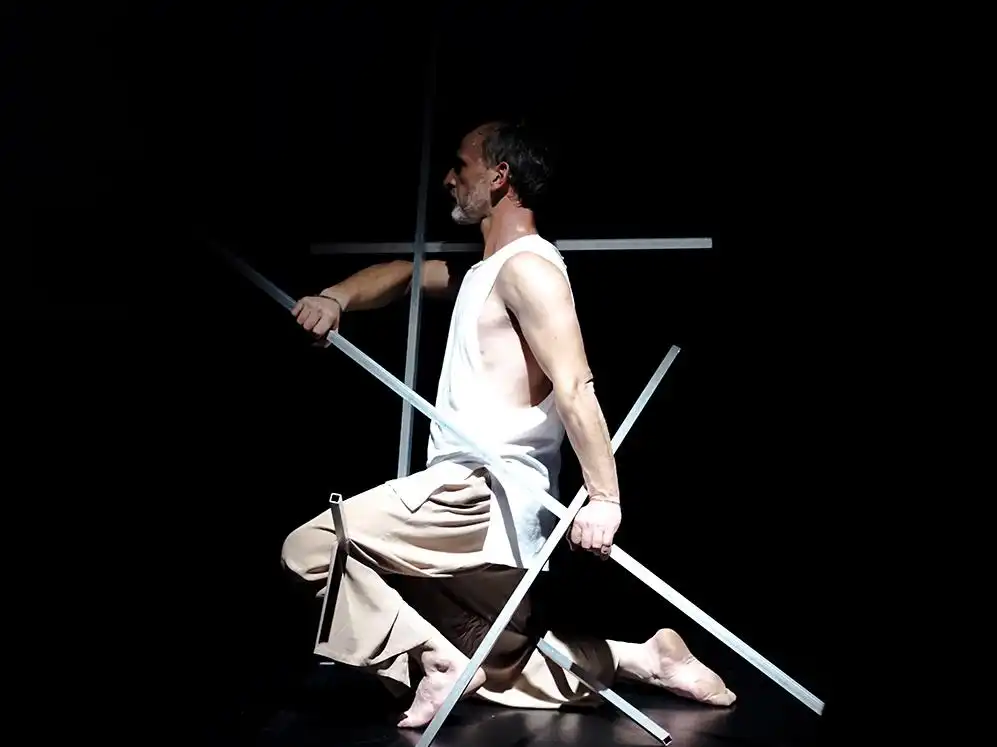{data-gallery="marasma"}

- 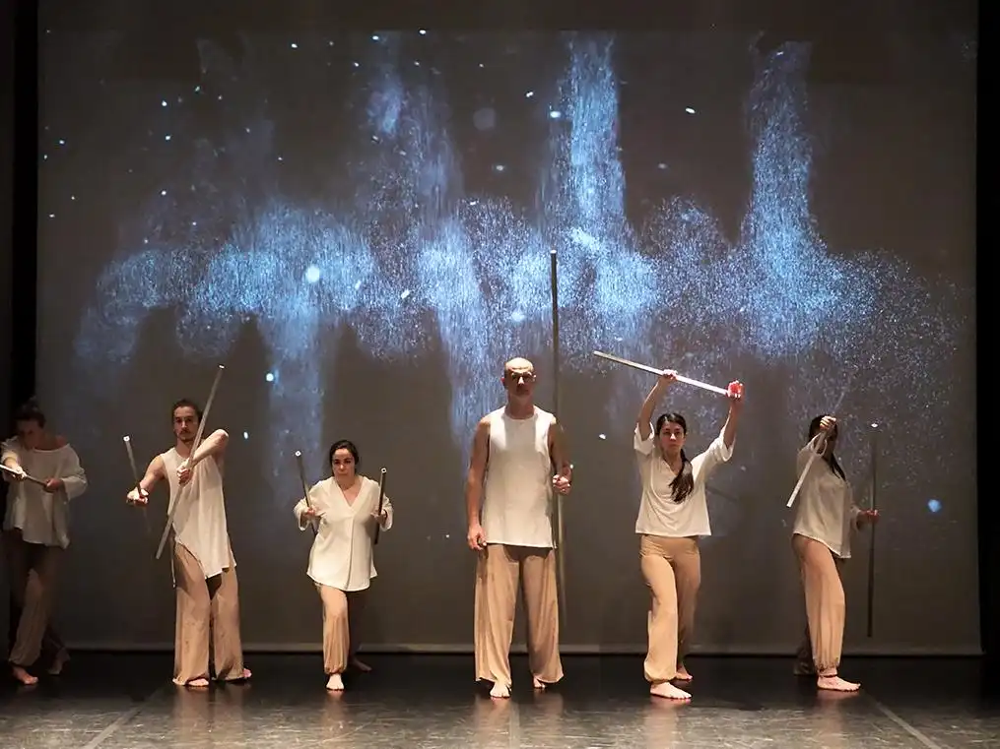{data-gallery="marasma"}

- 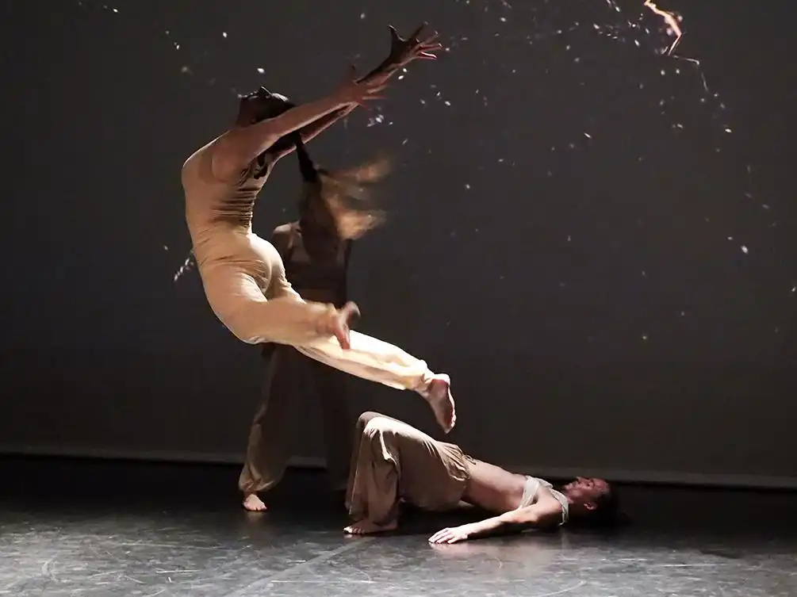{data-gallery="marasma"}

- 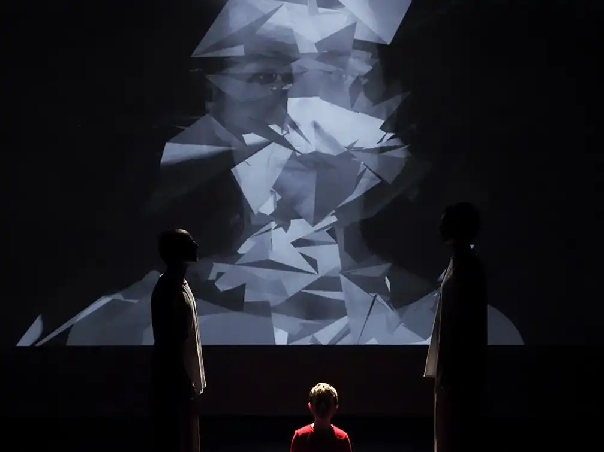{data-gallery="marasma"}

- 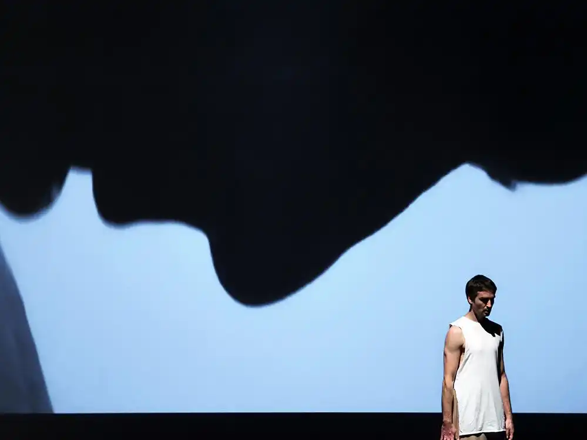{data-gallery="marasma"}

- 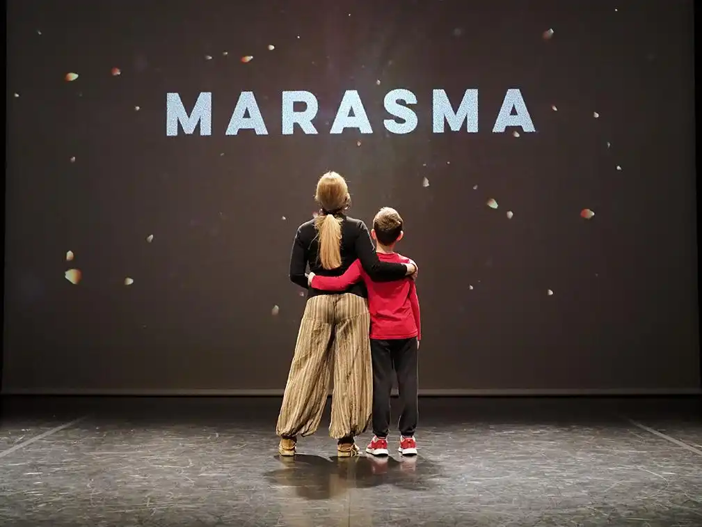{data-gallery="marasma"}

- 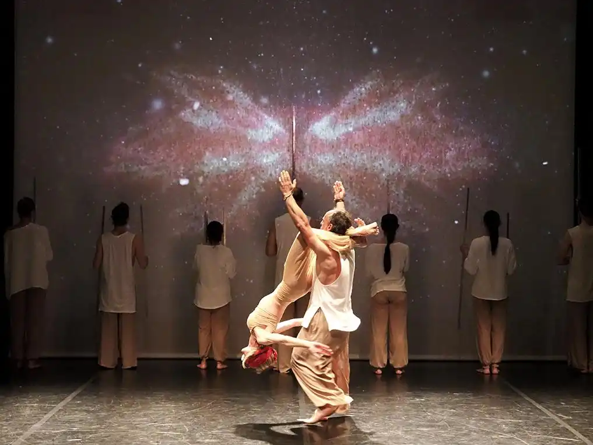{data-gallery="marasma"}

- 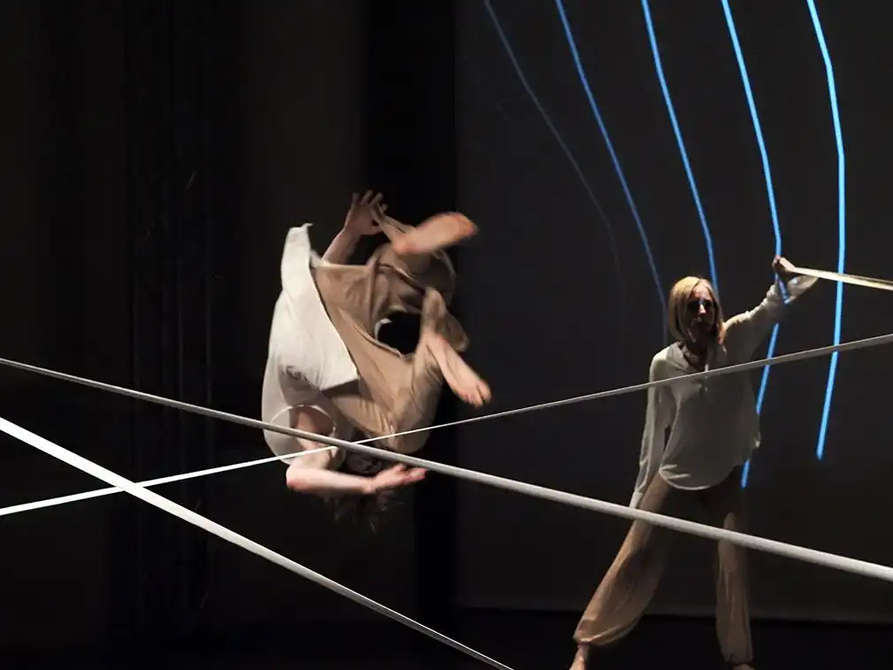{data-gallery="marasma"}

- 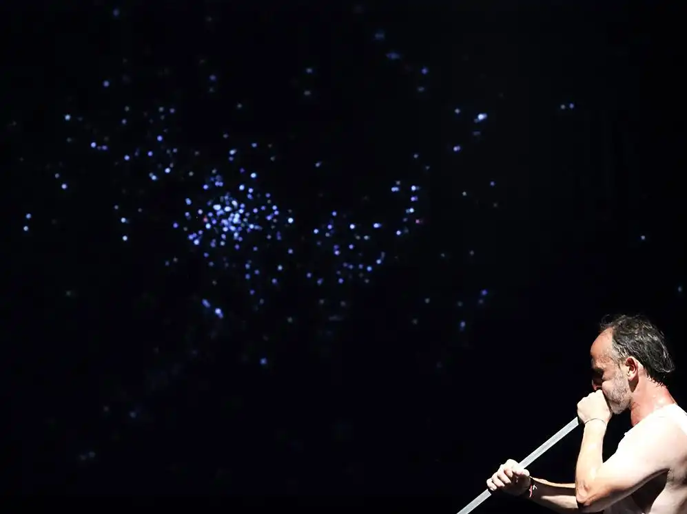{data-gallery="marasma"}

- {data-gallery="marasma"}

- 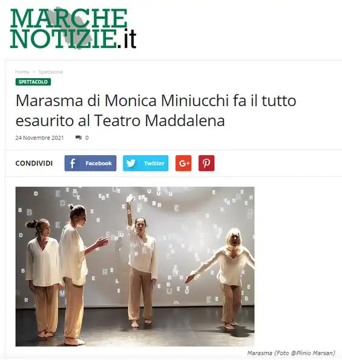{data-gallery="marasma"}

