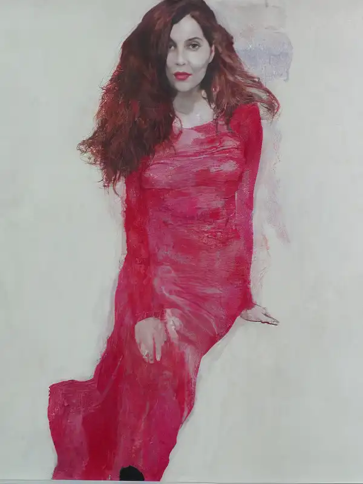

# E Medea? [di Quirino Principe]

*Nel 2002 scrissi e allestii, insieme a Marco Facondini e Lucia Ferrati, una «Medea» per il cui programma di sala [Quirino Principe](https://it.wikipedia.org/wiki/Quirino_Principe) mi regalò questo testo.*

<!-- more --> 

---

**E Medea?**

Il gesto che la fissa in eterno e fa di lei un archetipo fra i supremi trasmessi in eredità dal *mythos* dovrebbe essere, secondo la tradizione più antica avvalorata da Euripide, l’uccisione dei figli. Aggiungiamo: l’uccisione per vendetta.

Questa è la sua unicità archetipica, ché altrimenti l’infanticidio sarebbe un *topos* diffuso nei miti ellenici. Atamante re di Tebe (lo ricorda anche Dante in *Inferno XXX, 1-12*), colto da follia, uccide orrendamente il figlioletto Learco; sua moglie Ino, disperata, si uccide annegandosi con l’altro figlio Melicerta. Ma è insania, appunto, non lucida vendetta. Che l’eccidio dei bimbi sia il gesto individualizzante di Medea è implicito nei frammenti di Ennio, presumibilmente nella tragedia perduta di Ovidio, molto più tardi in Pierre Corneille, in Giovanni Battista Niccolini, in Franz Grillparzer, nell’opera di Luigi Cherubini.

Dal momento che siamo scivolati entro l’ambito del teatro musicale e del lascito operistico, avvertiamo un riflesso vivido di quel *topos*, l’infanticidio, nel dramma *Norma ou L’infanticide* di Alexandre Soumet, fonte del libretto di Felice Romani per l’opera omonima di Vincenzo Bellini e da quel libretto, dove l’infanticidio non ha luogo, molto diverso.

Ma l’altro tema, che diventa primario, è disegnato da Seneca nella sua *Medea*, e i due versi finali, citati in exergo, gli danno una densità inaudita. Nello scrittore ispano-latino, non l’infanticidio è l’entelechia poetica di Medea, bensì la natura di dèmone infernale che nella spaventosa creatura femminile (ma è davvero un essere «creato»?) riemerge alla fine dopo le mentite spoglie di donna passionalmente innamorata. La riemersione svela un’altra lontana affinità: quella con la «Nixe», l’ondina, la «rusalka», la sirenetta, esseri dalla femminilità subacquea e comunque entità del profondo (così come Poseidone è strettissimamente affine a Hades/Plutone), di nuovo abissali dopo un disperato tentativo di appartenere al mondo terrestre e all’amore per la virilità di carne e sangue. La natura infernale dell’archetipo-Medea si associa, nel dramma del filosofo poeta, a un’idea forte: che non esistano gli dèi, come grida disperatamente Giàsone, e che alla proclamazione di ateismo si connetta la persuasione che il mondo sia dominato dall’inferno, non dal cielo.

Tutto questo dà a *Medea* di Seneca un posto privilegiato nella tradizione teatrale e letteraria, e soprattutto nel sistema di relazioni mentali che la cultura moderna ha con il *mythos*. I versi finali di «quella» *Medea* sono un modello ermeneutico di un complesso sistema mentale, un autentico universo-microcosmo. Possiamo indicare le linee su cui si dovrebbe indirizzare un’analisi: ne verrebbe, più che un libro, un’enciclopedia del male di vivere ispirata dal disagio della civiltà.

Abbiamo detto «possiamo indicare», anche se la drammaturgia ideata e attivata da Davide Riboli rende superfluo, grazie alla propria evidenza, quel «possiamo». Prima, però, paghiamo un tributo d’obbligo: celebriamo la liturgia dei nomi e degli etimi onomastici, irrinunciabile quando si parli di mitopoiesi antica o moderna. Si è parlato di consanguineità secondo gradi di discendenza o di ascendenza (per esempio, Euripide-Seneca-Corneille-Grilparzer-Soumet, o, in altri termini. Medea-Norma). Parliamo anche di parentela secondo collateralità: Medea è sorella di Ino (l’abbiamo notato) e di Arianna. Tra Medea e Arianna il legame di sangue poetico e archetipico è costituito da due altri *topoi*:
- la giovane donna figlia di re che, contro i suoi, aiuta l’altro, lo straniero di cui è innamorata, e per aiutarlo danneggia la propria terra cui l’amato e seduttore sottrae qualcosa (la funzione «aiutante» è fra le principali elencate da Vladimir Jakovlevič Propp nella sua Morfologia della fiaba (*Morfologija skazki*).
- la donna che sacrifica tutto all’amato straniero, anzi, all’amato «nemico», e tuttavia (o forse proprio per questo…?) è da lui crudelmente abbandonata e tradita.

<figure markdown>
  { width="500" }
  <figcaption>Renato Bertini, Ritratto di Lucia Ferrati</figcaption>
</figure>

A parte queste affinità, tutto il resto contrappone le due *symbolische Formen*. Arianna, in dialetto attico «Ariadne», è figlia di Minosse re di Creta, ed è fanciulla dalla bellezza candida e fresca; il suo nome deriva da *ari-hagne*, che nell’idioma greco così com’era parlato dai cretesi significava «pura al sommo grado».

Medea, figlia di Eete re di Ea, è maliarda dal fascino malvagio, secondo la maggior parte delle narrazioni mitiche; impone la propria ferrea volontà al debole fratello Absirto e al padre cupo e tessitore di insidie. La radice del suo nome è probabilmente *mêdos*, «consiglio», «progetto», «astuzia», da cui il verbo *médomai*, «delibero», «decido», ma anche «escogito», «tramo». Crediamo, però, che il nome abbia qualche consanguineità etimologica con *mêtis*, celeberrimo sostantivo che significa «scaltrezza», «saggezza», persino «genialità», ma anche (è un po’ azzardato, ma non impossibile) con *medéis*, «nessuno»: in tal caso, esisterebbe una palese relazione con *oudéis*, Odysseus. Nella dualità Arianna-Medea si riprodurrebbe al femminile la contrapposizione Achille-Odisseo, forma-evento. Ancora: Arianna aiuta Teseo con il filo, embrionale espediente tecnico e messo di comunicazione, ma anche artificio di magia bianca. Medea, esperta in conoscenze occulte, aiuta Giàsone con la sua magia nera. L’opposizione bianco-nero ritornerà nella scacchiera di Omar Khayyām, alternanza di bianchi giorni e nere notti ossia del tempo infinito, come scrive Jorge Luis Borges, commentando Omar, nella poesia *Ajedrez*.

Sedotta e abbandonata, Arianna è donna dal destino terrestre e «naturale», vittima dell’ennesimo e sciagurato archetipo radicato nella tradizione d’Occidente non meno che in quelle orientali: il maschilismo, la concezione della società secondo il dominio assoluto del maschio. Medea rovescia il rapporto: nei versi finali del dramma di Seneca, è lei che impone la propria volontà con la violenza, mentre Giàsone leva il suo lamento querulo e femmineo. Eppure, il destino di Medea, quasi dissotterrandosi e spezzando la crosta della superfice terrestre, si è andato rivelando orribilmente quotidiano, archetipo di vicende che la più sciatta cronaca tutti i giorni cucina: infanticidio per vendetta, squallore del tradimento sessuale, divorzio dalla sposa attempata e sformata dalle maternità per inseguire il miraggio di una carne più giovane. Di acremente moderno è anche una poetica da film dell’orrore: Glauce, figlia di Creonte re di Corinto e nuova giovanissima sposa di Giàsone, è bruciata viva e liquefatta dall’ardore micidiale di una veste donata da Medea, fintamente rassegnata. La narrazione «a distanza» (soltanto Seneca, nel mondo antico, propone l’orrore direttamente sulla scena, anche se si dice che le sue tragedie furono scritte per essere lette, non rappresentate) che interviene nel dramma di Euripide è raccapricciante, degna del *grand-guignol* o di Roger Corman (o di Dario Argento). La storia di Medea, Giàsone e Glauce è un meccanismo affidato al logos mitopoietico al fine di rappresentare il cosmo: beninteso, il macrocosmo. Forse la natura infernale di Medea è prefigurata sin dall’origine dell’archetipo. L’orrore, come Nietzsche intuì nelle prime pagine di *Geburt der Tragödie*, è connaturato nei miti ellenici, la cui solarità e frontalità si frantumano al primo esame non superficiale. Quei miti, soffocati dalle menzogne delle religioni monoteistiche e moralistiche, sono in realtà indistruttibili: ci insegnano che tutto è infernale, dal momento che il destino di tutto l’esistente non può essere se non l’inferno.

*Quirino Principe, maggio 2002*