Ho iniziato a lavorare su _Medea_ nel 1990, su suggerimento di Anne Laure Poulain che avevo incontrato lavorando con Carmelo Bene alla Biennale di Venezia (Teatro), ma non sono riuscito a raggiungere la versione definitiva fino al 2002.

<!-- more -->

Il testo si compone quasi completamente delle _Argonautiche_ di Apollonio Rodio e della _Medea_ di Seneca, che ho sempre preferito a quella di Euripide; la parte finale è tratta da una poesie di Carmelo Bene pubblicata nella raccolta _Mal de' Fiori_.

Questo non ha comunque comportato grandi cambiamenti al soggetto originale: Medea, creatura selvaggia e antica, assai più divina che umana, segue Giasone per amore, dimenticando le proprie origini e abbandonando la propria terra. Il dolore per il successivo tradimento di Giasone la riporterà alla sua natura originaria, di cui la terribile vendetta è solo un'epifania.

Quando chiesi a [Marco Facondini](https://www.researchgate.net/profile/Marco-Facondini) di renderizzare i vocali di tutti i personaggi, comprese quelle maschili, a partire dalle formanti della voce di Lucia Ferrati non mi nascose la sua perplessità.

In quel periodo il mondo dell'audio digitale aveva fatto grandi progressi, ma non aveva certo raggiunto le possibilità espressive di cui disponiamo oggi. Ma Marco amava le sfide e in un paio di mesi elaborammo un metodo per distillare dalla voce di Lucia un Giasone perfetto. Non avendo la forza tecnologica di moltiplicare il risultato ottenuto per tutti i personaggi, ridussi il testo alle parti dei soli Giasone e Medea. Lucia Ferrati ne dette un'interpretazione magistrale che potete ascoltare nella registrazione qui sotto (meglio se in cuffia).

- [Medea Remastered](https://youtu.be/KJzheJlKlHc) - *ascoltabile solo su YouTube a causa di restrizioni dovute ai diritti d'autore relativi ad alcuni dei brani musicali che abbiamo impiegato*.

I passi di Giasone e i suoni d'acqua e metallo in cui si dissolve la voce di Medea sono stati ottenuti dai campioni audio che avevamo realizzato in Biennale con Carmelo Bene, giocando con i primi campionatori di cui potemmo disporre.

Il debutto avvenne a Cortona nel 2002, al Teatro "Capannone", grazie alla produzione di _Machine de Théâtre_, che in quegli anni era sia compagnia teatrale che forza produttiva, composta da Mira e Marco Andriolo e Galatea Ranzi.

Il programma di sala conteneva un testo introduttivo di Quirino Principe, cui sarò per sempre grato per la cortesia e la generosità, che potete leggere con un [clic qui](medea-principe.md).

- 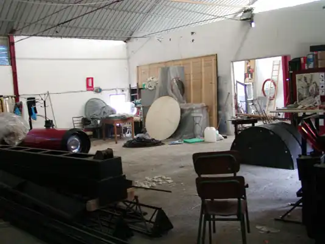{data-gallery="medea"}

- 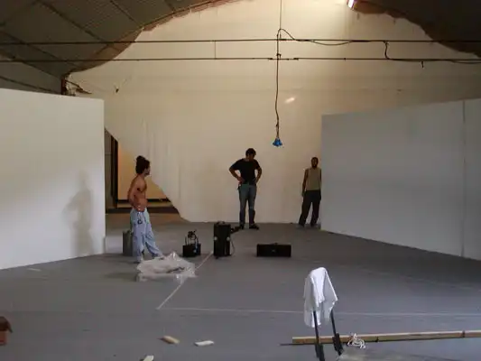{data-gallery="medea"}

- 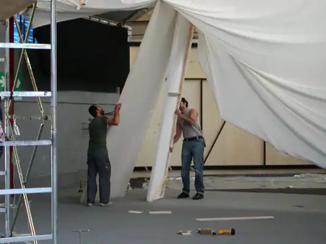{data-gallery="medea"}

- 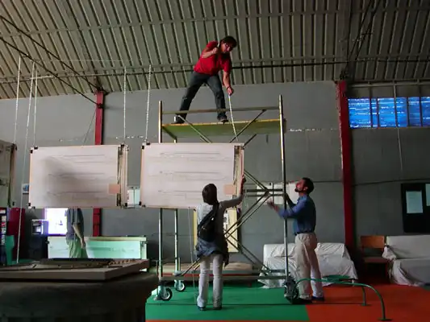{data-gallery="medea"}

- 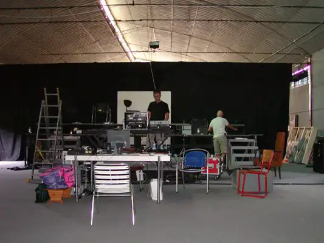{data-gallery="medea"}

- 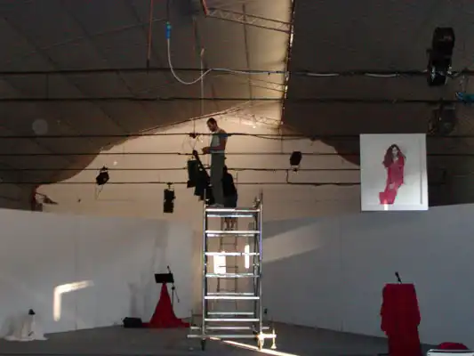{data-gallery="medea"}

- 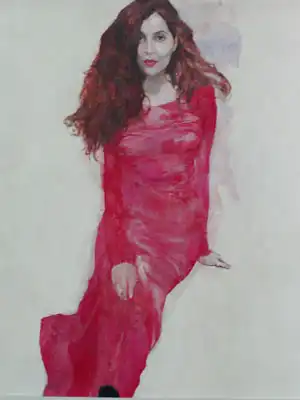{data-gallery="medea"}

- 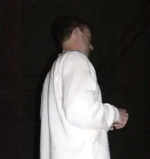{data-gallery="medea"}

- 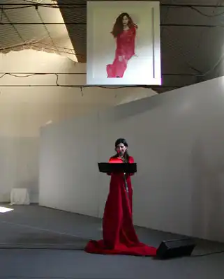{data-gallery="medea"}

- 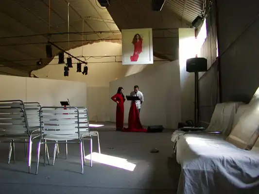{data-gallery="medea"}

- 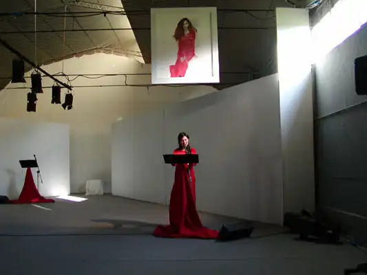{data-gallery="medea"}

- 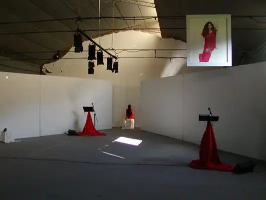{data-gallery="medea"}

- 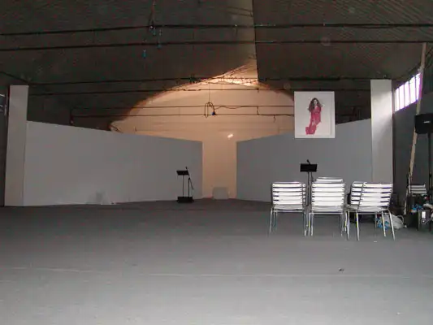{data-gallery="medea"}

- 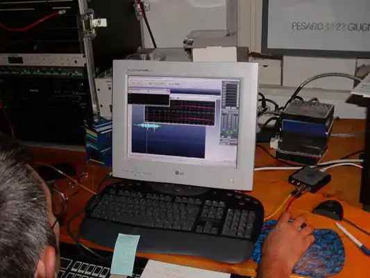{data-gallery="medea"}

- 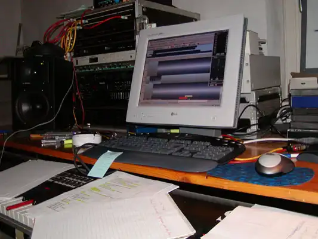{data-gallery="medea"}

- 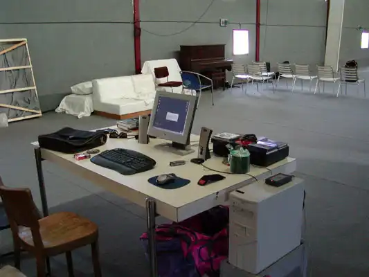{data-gallery="medea"}

- 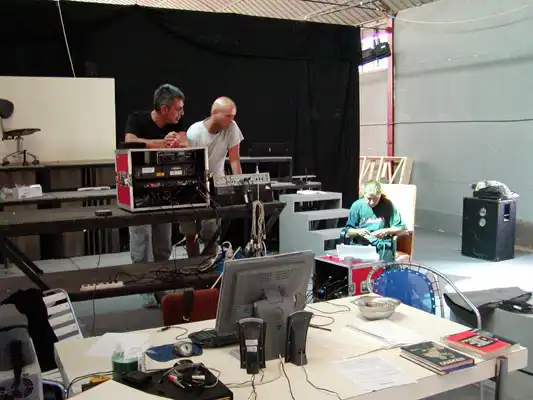{data-gallery="medea"}

- 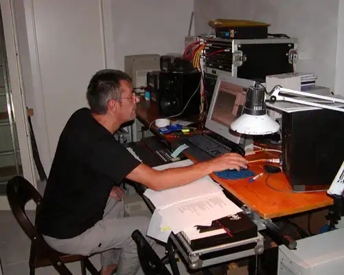{data-gallery="medea"}

- 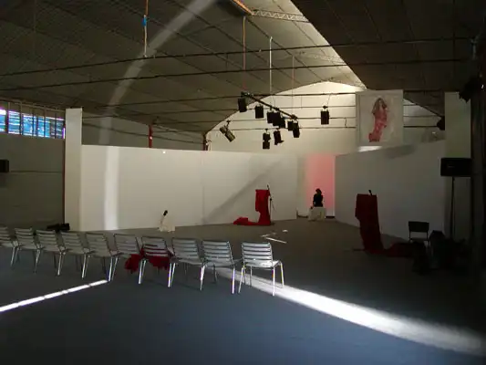{data-gallery="medea"}

