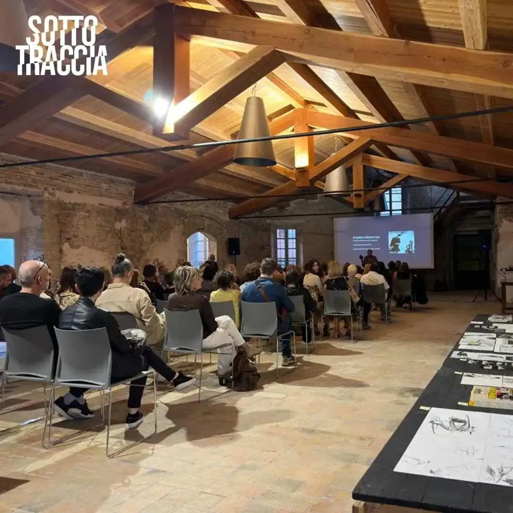
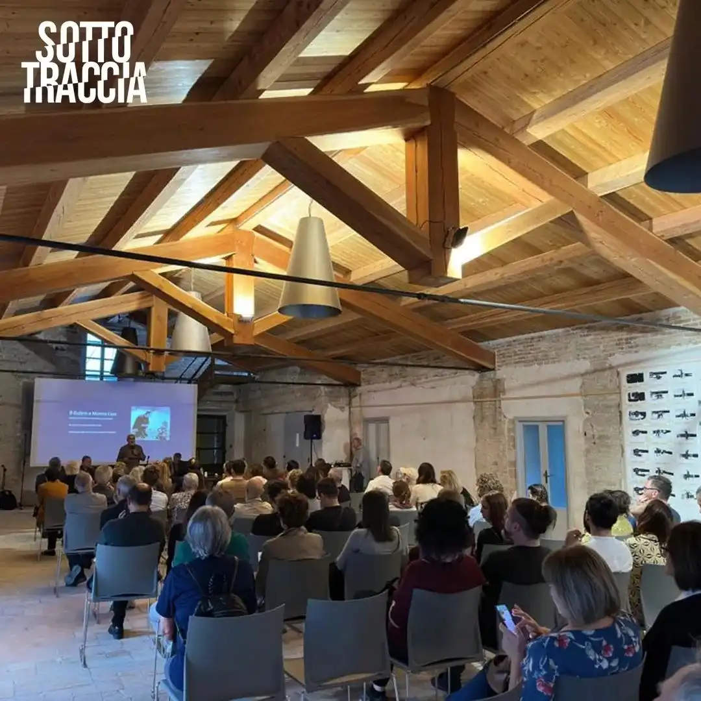
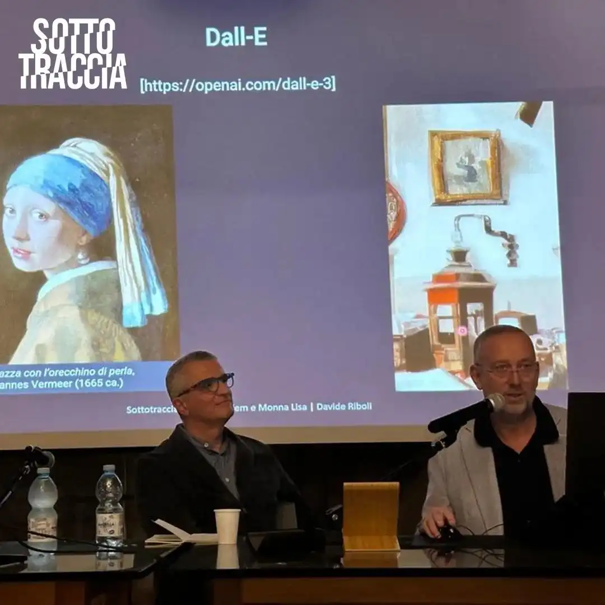
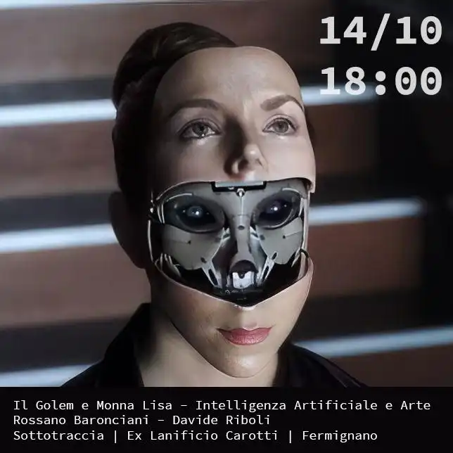
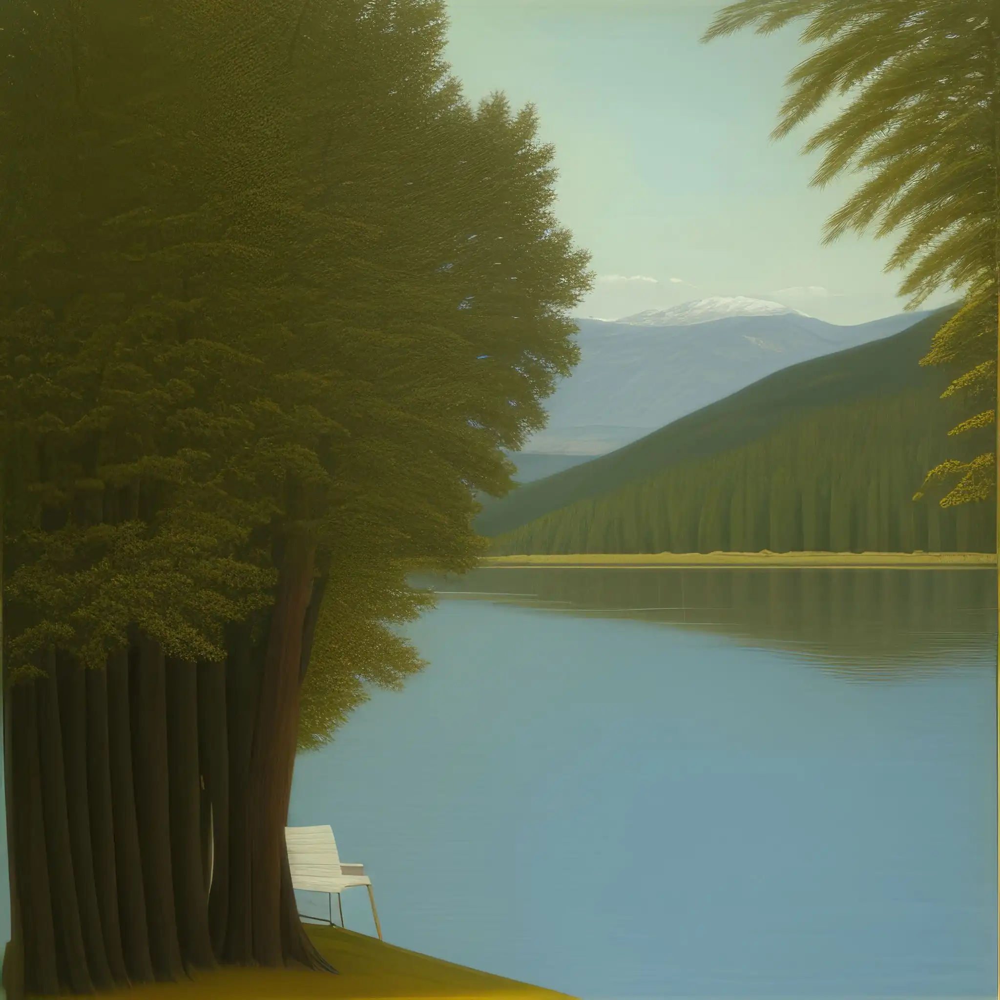

*Ho ripescato questo *post* dalla mia agenda del 2023 come ricordo della partenza d'una giostra che per il momento non accenna a fermarsi.*

<!-- more --> 

---

Sabato scorso, a Fermignano, io e [Rossano Baronciani](http://rossanobaronciani.blogspot.com/) abbiamo chiacchierato di fronte ad un centinaio di persone di Intelligenze Artificiali e Arte.

Ci aveva invitati Silvano Bacciardi, all'interno del Sottotraccia Festival che organizza con la [Fondazione Ex Lanificio Carotti](https://www.instagram.com/exlanificiocarotti).

È stato molto bello, con tanti amici in platea (tra cui alcuni che non vedevo da decenni!). Peccato non essere riusciti a incontrarci con Gianluigi Toccafondo. Tutte le sale erano piene di suoi lavori perché aveva tenuto un *workshop* la settimana prima, ma non siamo riusciti a incrociarci e ormai sono anni che non ci incontriamo più.

A Fermignano torneremo comunque presto (speriamo...).

Nota a me stesso: il quadro con la sedia vuota si intitola "Il pescatore" ed è stato generato durante la conferenza. Appena arrivati, con V. abbiamo visto dalla finestra un pescatore, vicino a delle anatre.

- {data-gallery="mitoarianna"}

- {data-gallery="mitoarianna"}

- {data-gallery="mitoarianna"}

- {data-gallery="mitoarianna"}

- {data-gallery="mitoarianna"}

