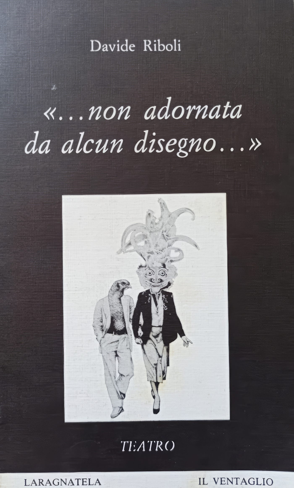
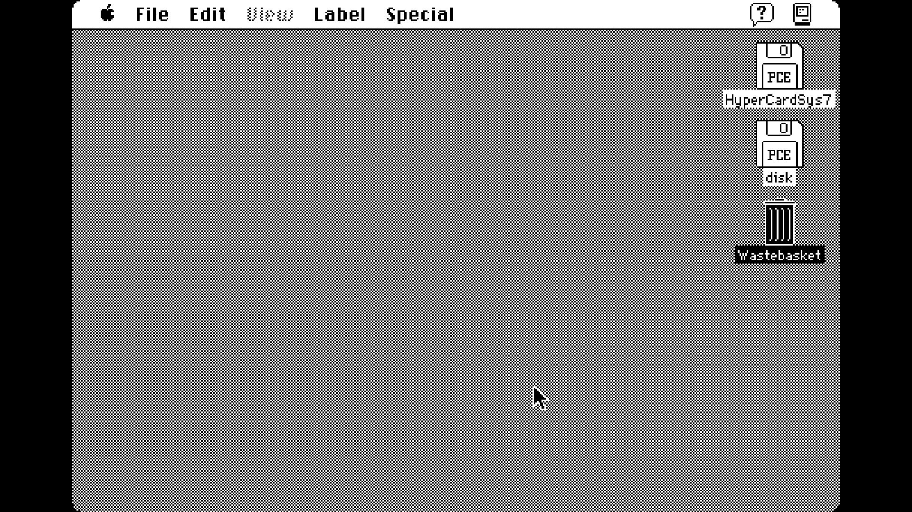
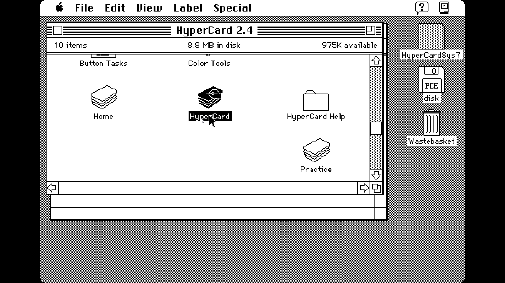
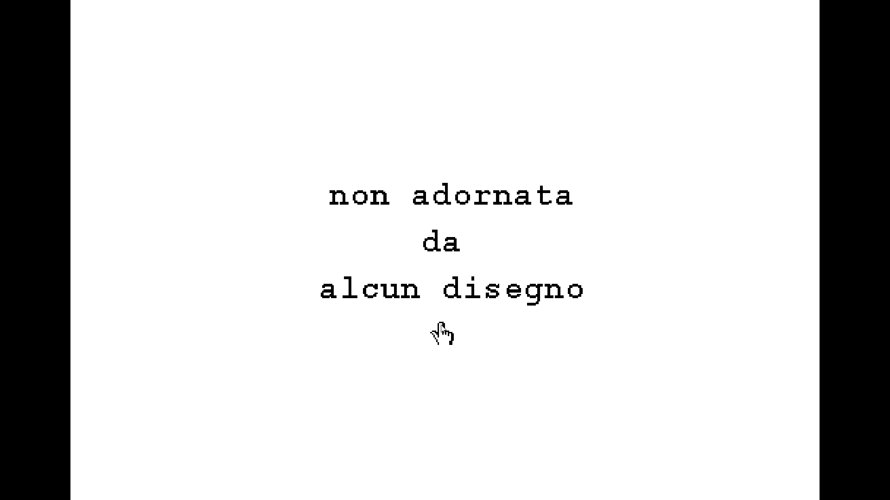
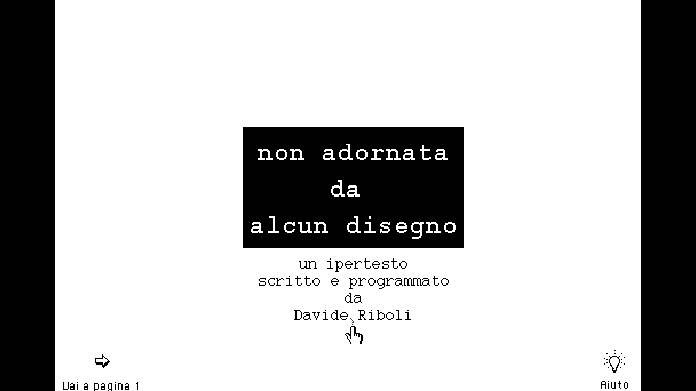
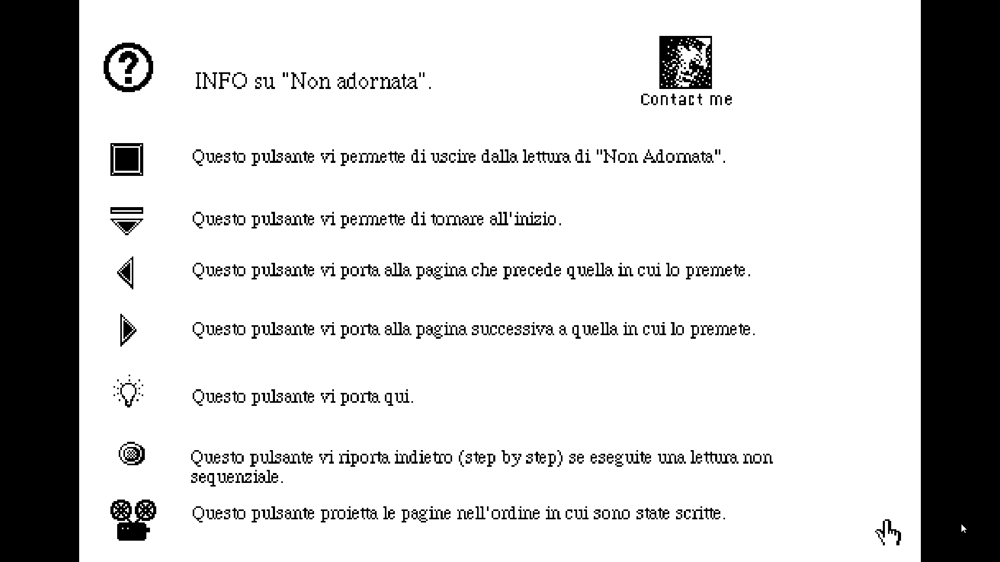
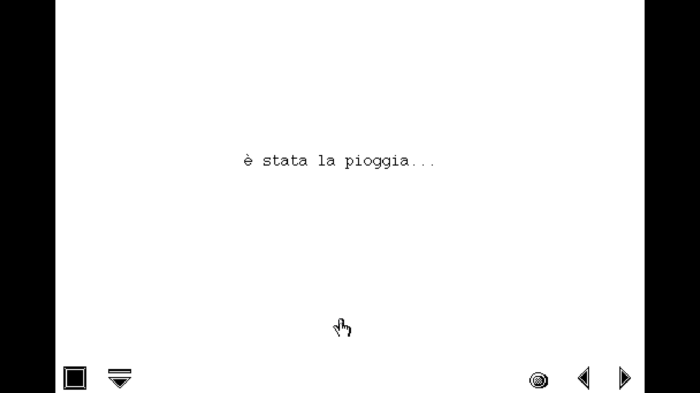
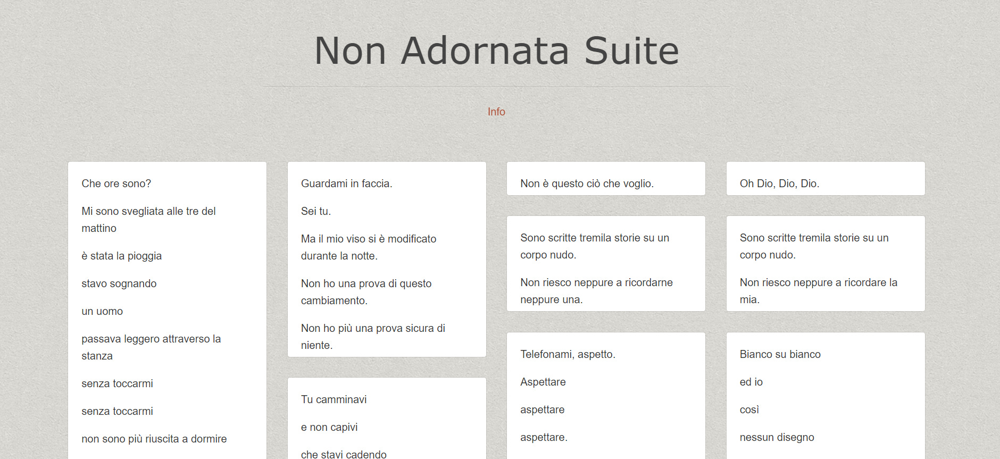

*Questo lavoro ha un curioso destino ed una ancor più curiosa abitudine ad entrare e uscire dalla mia vita. Mettetevi comodi: la storia è un po’ lunga…*

<!-- more --> 

---
## Il libro

Lo scrissi verso la fine del 1987, applicando radicalmente il metodo del *cut-up* di [William Burroughs](https://it.wikipedia.org/wiki/William_S._Burroughs) a frammenti di miei racconti, pagine di altri autori, articoli di giornale, testi di canzoni e Dio sa che altro. Quel che si definerebbe del “materiale molto eterogeneo”.

Stefano Marotta mi regalò l’uso di un suo dipinto, intitolato *Il Pollo e la Medusa* per la copertina del volume che fu stampato nel 1988 dalla casa editrice “Il Ventaglio” di Roma. Stefano era il figlio di Gino Marotta che avevo conosciuto nello stesso periodo, quando realizzò la scenografia di *Hommelette for Hamlet* per Carmelo Bene, con la quale vinse anche un Premio UBU.

- {data-gallery="nonadornatabook"}

La casa editrice invece, fallì l’anno successivo. Avevano scelto *Non Adornata* come primo volume di una collana di nuova drammaturgia che, oltre ad essere il primo, fu anche l’ultimo. Mi sono sempre sentito un po’ responsabile…

Col fallimento dell’editore e una tiratura non esattamente da best seller, la prima edizione è ormai introvabile. Ne ho rintracciate alcune copie su Ebay (in vendita allo stratosferico prezzo di 4 €), una alla Biblioteca del Congresso a Washington (non è merito mio, lì archiviano tutto) e ne risulta un’altra presso la Biblioteca Nazionale Centrale di Firenze, archiviata sotto “letteratura drammatica italiana” (per la qual cosa dovrei scusarmi con Pirandello, D’Annunzio e De Filippo).

Questa è il testo introduttivo che mi regalò Mimmo Mongelli: spiega meglio di quanto ne sia capace io, cosa ho cercato di (s)combinare con quelle pagine.

### Introduzione di Mimmo Mongelli

*Che cosa consente ad un testo di essere considerato teatrale? Forse l’esistenza di uno o più personaggi? di un intreccio e di uno scioglimento? di dialoghi? di una struttura convenzionalmente definita drammaturgica e che si esplicita nella divisione in atti, scene e così via?*

*Se così fosse, il lavoro di Davide Riboli non potrebbe dirsi teatrale: non ci sono personaggi e quindi psicologie, né intrecci, né dialoghi, né atti…*

*È forse per questa squisita ambiguità della sua natura che significativamente apre la nostra collana di teatro una sorta di dichiarazione sulla impossibilità di definire la forma della drammaturgia ed al contempo un sostegno a favore di una scrittura teatrale che vive in un rapporto di scambio ed assorbimento con altri linguaggi espressivi.*

*In Non Adornata da Alcun Disegno i riferimenti che a questo proposito ci sovvengono sono da una parte le forme letterarie che appartengono al repertorio più colto (dal poemetto al romanzo picaresco); dall’altra i prodotti della cultura di consumo (dai testi di canzoni alle immagini e dialoghi dei film rosa).*

*Una miscela di questi elementi, libera da qualsiasi vincolo e regola, che riesce a dare ulteriore godibilità a ciò che è “alto” e prestigio culturale a ciò che è “basso” è il dato che porta il testo di Riboli a fare un passo lungo e sicuro sulla strada di una drammaturgia nuova anche se tutta da inventare, ma che ha già al suo attivo il merito di aver tagliato i ponti con le consuetudini teatrali che sotto la veste di “nuova drammaturgia” continuano a riproporre schemi obsoleti.*

---

## Lo spettacolo teatrale

Debuttammo a Pesaro, il 9 febbraio 1988, con la mia regia, l'interpretazione di Mira Andriolo e le musiche e le elaborazioni elettroniche di Marco Facondini. Quel lavoro segnò l’inizio di una grande amicizia e di un lungo sodalizio artistico con Marco. La sua perdita è un dolore che non smette di ferirmi.

Dopo Pesaro, lo spettacolo arrivò a Roma dove, grazie a Marina Polla De Luca e alla produzione di Carmelo Bene, fece il tutto esaurito per oltre tre mesi. Il digitale stava appena entrando negli studi di registrazione: strumenti che oggi consideriamo elementari, come i campionatori, allora non erano neppure immaginabili. Registrare su *hard disk* sembrava fantascienza (anche perché gli *hard disk* non c'erano, c'erano i *floppy*...). Lavoravamo per lo più con nastri magnetici e con quello che riuscivamo a spremere da hardware che oggi parrebbero giocattoli. Marco realizzò le musiche e le elaborazioni vocali con un [Atari 520ST](http://www.oldcomputers.net/atari520st.html). Lo spettacolo era tutto in playback, con l’attrice costantemente “fuori sync” con la sua medesima voce. A Carmelo Bene l'idea piacque molto e col suo aiuto ottenemmo un buon successo.

Poco dopo, Marco e io iniziammo a collaborare con Bene che, dopo aver prodotto il nostro esperimento, passò definitivamente alla produzione digitale del suono. Di quella versione solo i pochi scatti realizzati (e ritrovati) da [Sarah Victoria Spence](https://www.instagram.com/art_by_sarahvs/).

- {data-gallery="nonadornata"}

- {data-gallery="nonadornata"}

- {data-gallery="nonadornata"}

- {data-gallery="nonadornata"}

- {data-gallery="nonadornata"}

- {data-gallery="nonadornata"}

- {data-gallery="nonadornata"}

---

## Hypercard e Twitter

Negli anni successivi, dai materiali che mi erano serviti per la realizzazione di quello che con tutta probabilità è stato il primo spettacolo interamente recitato da registratore - ne ricavai una versione ipertestuale in [Hypercard](https://it.wikipedia.org/wiki/HyperCard) che fu pubblicata dalla rivista Applicando e una versione Twitter di cui, inspiegabilmente, una parte è [ancora *on-line*](https://twitter.com/NonAdornata).

Il lavoro più interessante era sicuramente quello in Hypercard. Ripensandoci, è stato il mio primo tentativo di unire la programmazione ai processi artistici di natura generativa. Assomigliava un po’ ad una versione metafisica e molto (molto!) minimale di Monkey Island, senza Guybrush Threepwood, ma è stato comunque uno dei primi (se non il primo) ipertesti in italiano. 

Twitter arrivò nel 2008, segnando a vent’anni di distanza la quarta “reincarnazione” di Non Adornata, dopo libro, palcoscenico e floppy.

- {data-gallery="nonadornatahyp"}

- {data-gallery="nonadornatahyp"}

- {data-gallery="nonadornatahyp"}

- {data-gallery="nonadornatahyp"}

- {data-gallery="nonadornatahyp"}

- {data-gallery="nonadornatahyp"}

---

## La macchina sei tu

Nel 2014, per un caso assolutamente fortuito, Marco Facondini ritrovò i nastri magnetici originali del 1988 che credevamo perduti e invece erano rimasti nel *rack* di un *flight-case* che non aprivamo da secoli. Le condizioni del segnale erano pessime, ma Marco riuscì comunque a ripulire le tracce e ad arricchirle di una dinamica sufficiente a riproporne l’ascolto.

Ne realizzammo una seconda versione, non più come spettacolo teatrale, ma in forma di installazione multimediale, basata sulla riproduzione casuale e ininterrotta dei sessantatré frammenti recuperati.

L’installazione fu ospitata dal 9 maggio al 28 giugno 2014, all'*Out of Range Digital Art Festival*.

Il video qui sotto è parte di uno di quelli di cui si componeva l'installazione, ma “funziona” anche da solo. Come sulla scena l’attrice non poteva trovare una sincronia con la propria voce, così in questa versione fatta di sole parole, l’orale e il proprio scritto non hanno un passo comune. Il sistema percettivo reagisce generando immagini mentali e così il nastro è un *prompt* e voi diventate la macchina generatrice di immagini. Questo richiede comunque la visione in un ambiente tranquillo, a tutto schermo e, se possibile, un paio di buone cuffie.

<iframe src='https://www.youtube.com/embed/jo7QsehnBCM' frameborder='0' allowfullscreen></iframe>

Se preferite leggere, potete azzardare un approccio non lineare al testo, usando [questa versione Tumblr](https://nonadornata.tumblr.com/) (ma niente cellulare; serve uno schermo grande). I frammenti di testo possono essere letti in qualsiasi ordine vogliate: anche facendo a pezzi la trama, l’istinto di sopravvivenza del senso avrà la meglio.

- {data-gallery="nonadornatatmblr"}

La storia parrebbe finita, ma non escludo che le parole di cui si compongono le tante forme di questo testo abbiano ancora qualcosa da dirmi.

