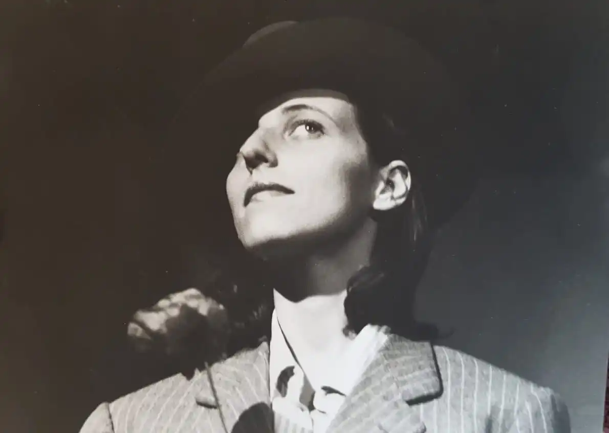
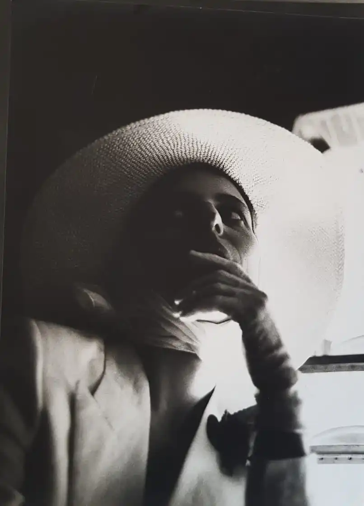
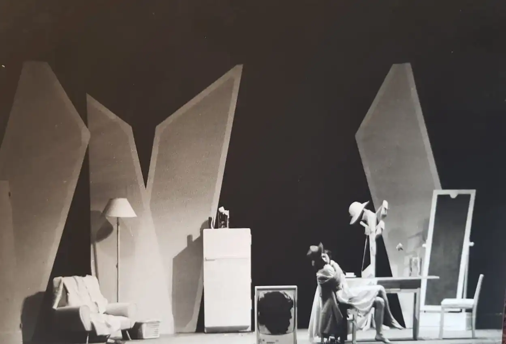
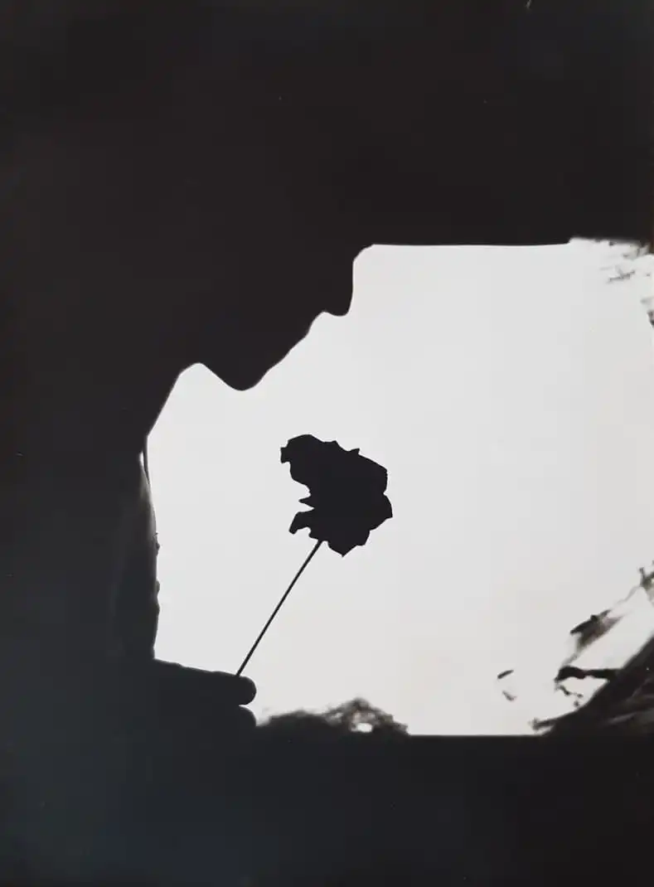
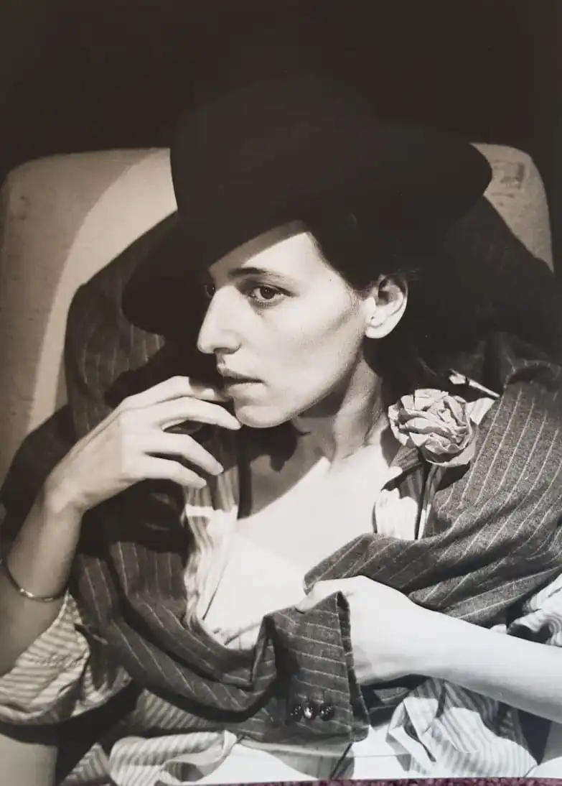
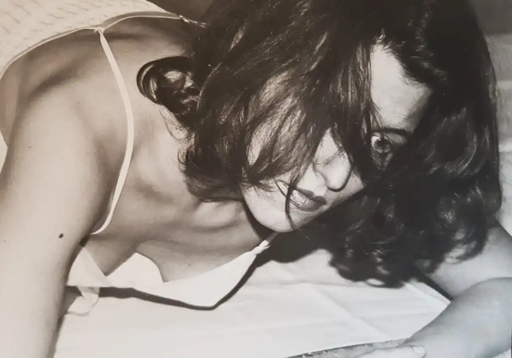
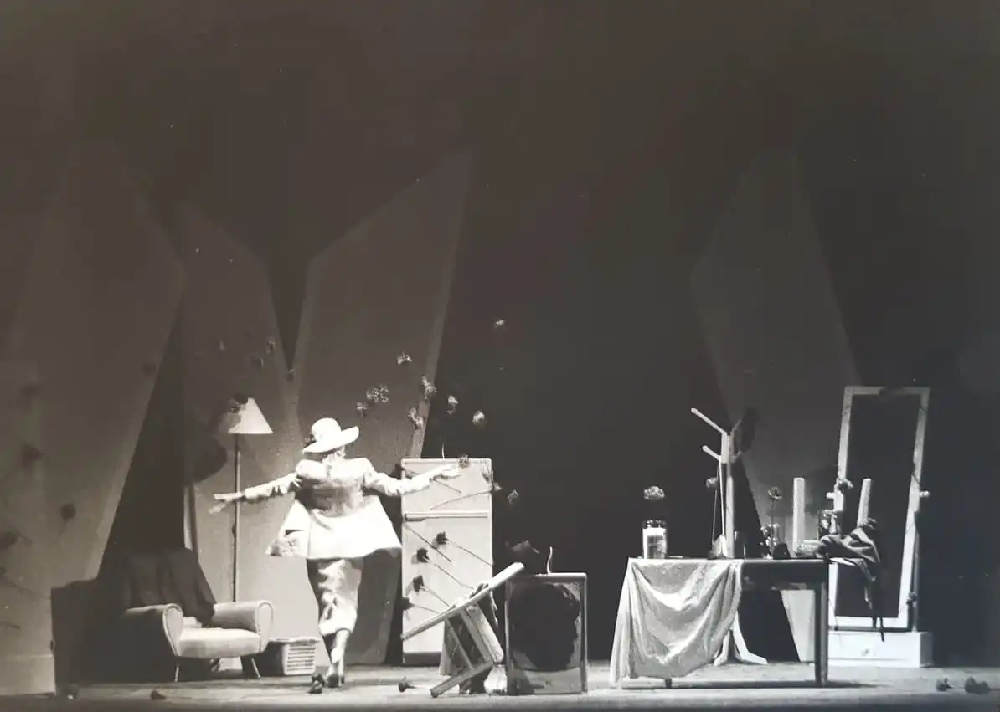

*Questo lavoro ha uno strano destino e un ancor più strano modo di continuare ad entrare e uscire dalla mia vita.*

<!-- more --> 

---

Lo scrissi verso la fine del 1987 e il 9 febbraio 1988 è andato in scena a Pesaro, con la mia regia, l'interpretazione di Mira Andriolo e le musiche e le elaborazioni elettroniche di Marco Facondini (1956-2021).

Dopo il debutto a Pesaro, lo spettacolo arrivò a Roma dove, grazie a Marina Polla De Luca e alla produzione di Carmelo Bene, fece il tutto esaurito per oltre tre mesi.

Il digitale stava appena entrando negli studi di registrazione: strumenti oggi considerati elementari, come i campionatori, non erano ancora neppure immaginabili. Registrare su hard disk sembrava fantascienza (anche perché gli hard disk non c'erano, c'erano i floppy...). Lavoravamo per lo più con nastri magnetici e con quello che riuscivamo a spremere da hardware che oggi sembrerebbero inadatti persino ai giochi per bambini (_Non Adornata_ è stato interamente realizzato su un [Atari 520ST](http://www.oldcomputers.net/atari520st.html)).

A Carmelo Bene piacque molto l'idea di un'attrice "fuori sync" da se stessa, mentre una macchina recitava la sua parte molto meglio di lei e con il suo aiuto ottenemmo un buon successo. Poco dopo Facondini e io iniziammo a collaborare con Bene che, dopo aver prodotto il nostro esperimento, passò definitivamente alla produzione digitale del suono. Di quella versione non rimangono che pochi scatti realizzati da [Sarah Victoria Spence](https://www.instagram.com/art_by_sarahvs/).

- {data-gallery="nonadornata"}

- {data-gallery="nonadornata"}

- {data-gallery="nonadornata"}

- {data-gallery="nonadornata"}

- {data-gallery="nonadornata"}

- {data-gallery="nonadornata"}

- {data-gallery="nonadornata"}

Il testo lo avevo ricavato applicando la tecnica del _cut-up_ elaborata da William Burroughs e Brion Gysyn a scritti miei, di altri autori, articoli di giornale e altro materiale piuttosto eterogeneo e fu pubblicato dalla casa editrice "Il Ventaglio" (Roma, ASIN B0000ECQVE), con un disegno di Stefano Marotta in copertina e l'introduzione di Domenico Mongelli di cui potete leggere un estratto qui.

Negli anni successivi, dai materiali che mi erano serviti per la realizzazione di quello che con tutta probabilità è stato il primo spettacolo interamente recitato da un computer, ricavai una [versione Hypercard](https://it.wikipedia.org/wiki/HyperCard) che fu pubblicata dalla rivista Applicando e una [versione Twitter](https://twitter.com/NonAdornata).

Nel 2014, per un caso assolutamente fortuito, Facondini ritrovò i nastri magnetici originali del 1988 che credevamo perduti. Le condizioni del segnale registrato erano pessime, ma Marco è riuscito a ripulire le tracce originali e ad arricchirle di una dinamica sufficiente a riproporle a distanza di oltre venticinque anni dalla prima registrazione.

Ne realizzammo una seconda versione, non più come spettacolo teatrale, ma in forma di installazione, basata sulla riproduzione casuale e ininterrotta dei sessantatré frammenti recuperati, che è stata ospitata, dal 9 maggio al 28 giugno 2014, all'_Out of Range Digital Art Festival_. 

Il video qui sotto è parte di uno dei sessantatré di cui si componeva l'installazione.

<iframe src='https://www.youtube.com/embed/jo7QsehnBCM' frameborder='0' allowfullscreen></iframe>

