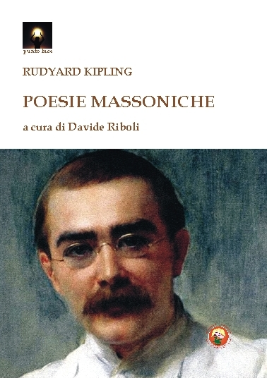

*Una traduzione personale di poesie massoniche di Kipling, note e meno note.*

<!-- more --> 

{width="300", align=left} L’etica e la simbologia della libera muratoria universale permeano buona parte della sterminata produzione letteraria di Rudyard Kipling che venne iniziato nel 1886.

Questa antologia, curata e tradotta da Davide Riboli, raccoglie poesie note e meno note del grande autore inglese, apertamente ispirate agli insegnamenti ed ai valori massonici.

La raccolta presenta i testi originali e la traduzione italiana commentata.

Il volume, edito per i tipi di Tipheret (ISBN 978-88-6496-385-3), può essere [richiesto direttamente all'editore](http://www.tipheret.org/product/poesie-massoniche/) oppure [ordinato via Amazon](https://amzn.eu/d/ery3YA0).