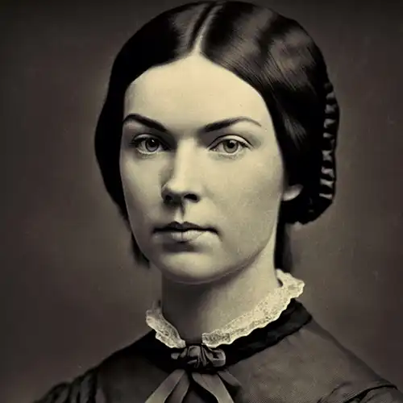

*Una poesia di Emily Dickinson su cui sono inciampato per caso e che mi piace molto. La liberissima traduzione è mia.*

<!-- more -->

---

<figure markdown>
  { width="500" }
  <figcaption>Emily Dickinson</figcaption>
</figure>

-   If I should die,

    And you should live,

    And time should gurgle on,

    And morn should beam,

    And noon should burn,

    As it has usual done;

    If birds should build as early,

    And bees as bustling go,

    One might depart at option

    From enterprise below!

    'T is sweet to know that stocks will stand

    When we with daisies lie,

    That commerce will continue,

    And trades as briskly fly.

    It makes the parting tranquil

    And keeps the soul serene,

    That gentlemen so sprightly

    Conduct the pleasing scene!

-   Se io dovessi morire,

    E tu dovessi vivere,

    E il tempo gorgogliare,

    E il mattino brillare,

    E il mezzodì bruciare,

    Com’è sempre andata;

    Se gli uccelli si mettessero all'opera sul presto,

    E le api si dessero altrettanto da fare,

    Ci si potrebbe accomiatare a discrezione

    Dalle imprese di quaggiù!

    È bello sapere che la Borsa terrà

    Quando tra le margherite giaceremo,

    Che il commercio continuerà,

    E gli affari svolazzeranno alacri.

    Rende la partenza tranquilla

    E mantiene l’anima serena,

    Che gentiluomini tanto arzilli

    Dirigano questa piacevole scena!

