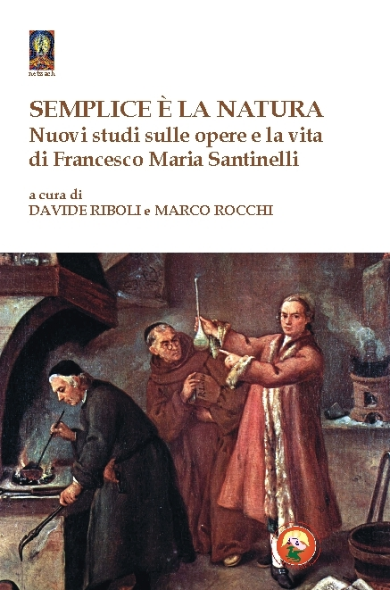

*Nuovi studi sulla vita e le opere di Francesco Maria Santinelli.*

<!-- more --> 

{width="300" align=left} Francesco Maria Santinelli nacque nel 1627 e nel corso della sua vita fu avventuriero, alchimista e autore di numerose opere teatrali, letterarie e poetiche.

Tra queste, quella di maggior successo è senza dubbio la *Lux Obnubilata*, componimento poetico di natura alchemica di cui si interessarono studiosi e appassionati d’eccellenza quali Isaac Newton, Oswald Wirth, Arturo Reghini e Carl Gustav Jung.

In occasione dei 350 anni dalla prima edizione della *Lux Obnubilata*, è stato organizzato un convegno di studi sulla vita e le opere del Santinelli che ha visto l’appassionata partecipazione di studiosi italiani e stranieri. I loro contributi costituiscono questo volume che – lungi dall’essere risolutivo riguardo alle opere dell’alchimista pesarese – si propone come nuovo stimolo allo studio della sua vita e dei suoi scritti.

Il volume, edito per i tipi di Tipheret (ISBN 978-88-6496-331-0), può essere [richiesto direttamente all'editore](http://www.tipheret.org/product/semplice-e-la-natura/).