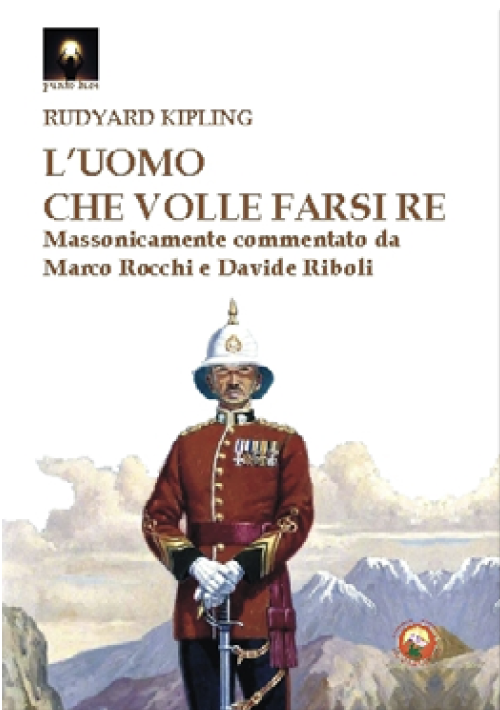

*Traduzione e commento, insieme a Marco Rocchi, del capolavoro di Kipling.*

<!-- more --> 

{width="300", align=left} Lungi dal poter essere interpretato come critica alla Massoneria per gli uomini di cui essa si compone, il racconto *L’uomo che volle essere re* ne celebra invece i valori universali e ammonisce i malintenzionati sul destino che aspetta chi volesse intenderne in mala fede scopi e strumenti. La chiave che apre le porte dei templi di tutti i Fratelli del mondo deve essere custodita da cuori puri e menti addestrate o la sola porta che aprirà sarà quella della rovina.

Occorre sottolineare che la notorietà dell’opera si deve anche alla trasposizione cinematografica voluta da John Huston che lavorò sulla sceneggiatura dagli anni Cinquanta fino alla realizzazione del 1975. Di non secondario interesse che il regista fosse massone, così come gli attori che aveva in animo di scritturare per i ruoli dei protagonisti Dravot e Carnehan, rispettivamente Clark Gable e Humprey Bogart. Il film riscosse un notevole successo e ottenne quattro nominations agli Oscar del 1976, per la miglior sceneggiatura non originale, migliore scenografia, migliori costumi e miglior montaggio, senza tuttavia vincere alcuna statuetta.

Il volume, edito per i tipi di Tipheret (ISBN 978-88-6496-448-5), può essere [richiesto direttamente all'editore](http://www.tipheret.org/product/luomo-che-volle-farsi-re/) oppure [ordinato via Amazon](https://amzn.eu/d/3vDEwHF).
