*Opere varie, tutte create tra il 2021 e il 2022 con [Stable Diffusion](https://stability.ai/stablediffusion) e varie tecniche di pittura digitale.*

<!-- more --> 

---

- 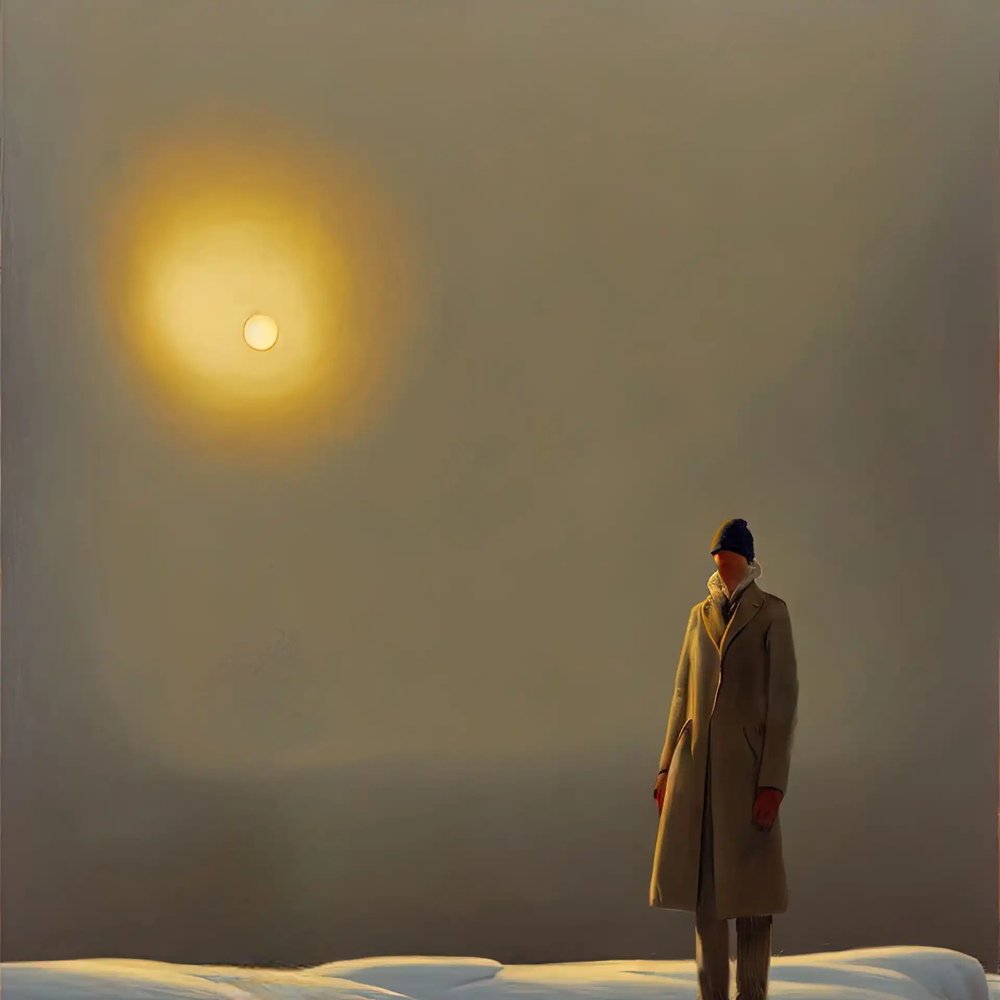{data-gallery="wndrkmr2021"}

- 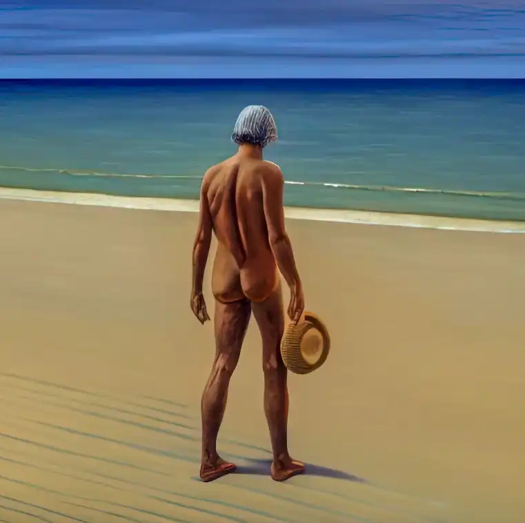{data-gallery="wndrkmr2021"}

- 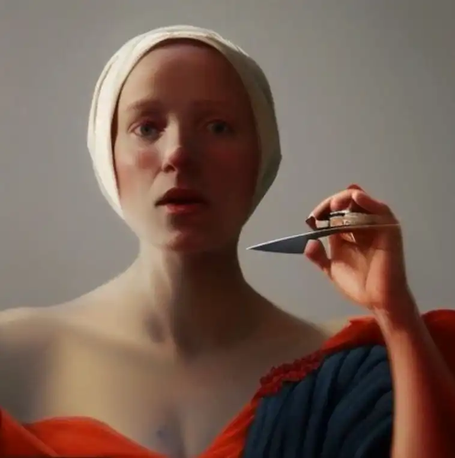{data-gallery="wndrkmr2021"}

- 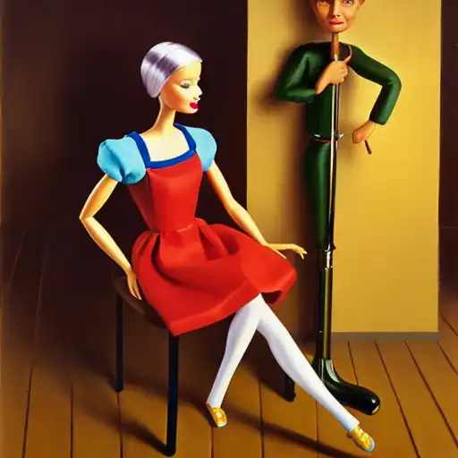{data-gallery="wndrkmr2021"}

- 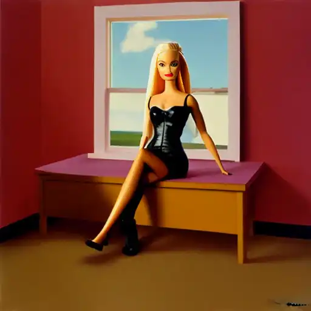{data-gallery="wndrkmr2021"}

- 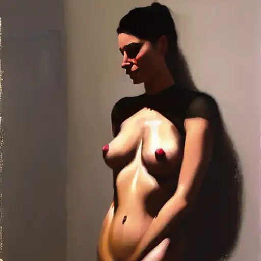{data-gallery="wndrkmr2021"}

- 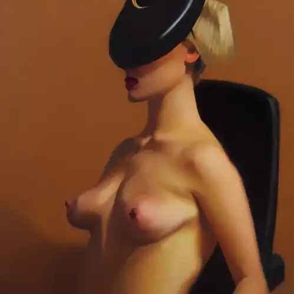{data-gallery="wndrkmr2021"}

- 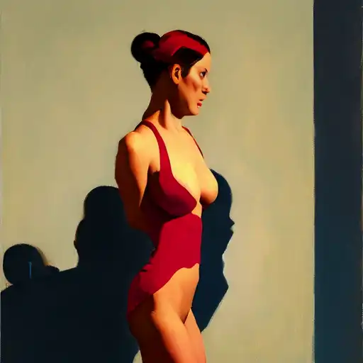{data-gallery="wndrkmr2021"}

- 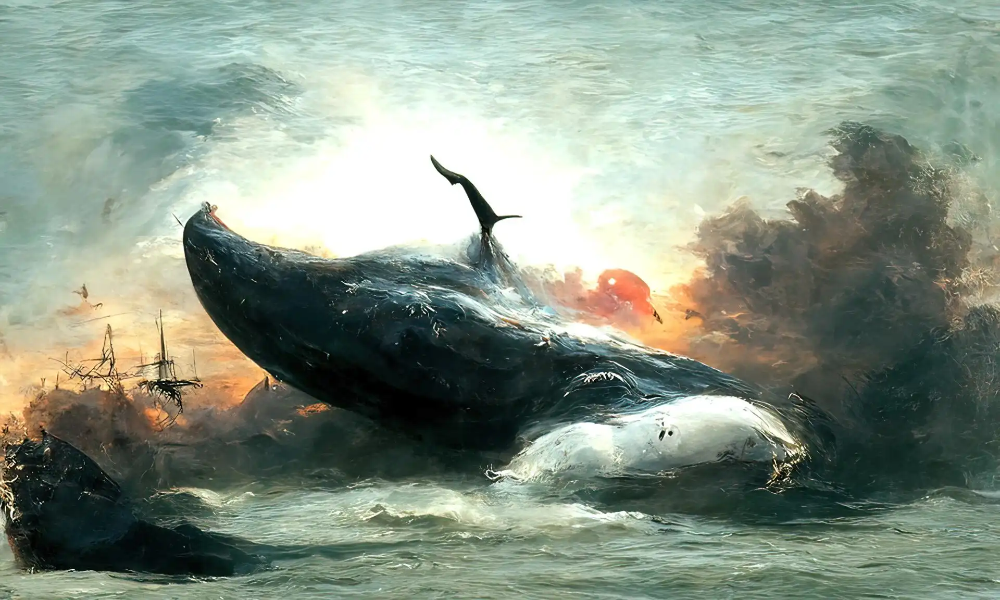{data-gallery="wndrkmr2021"}

- 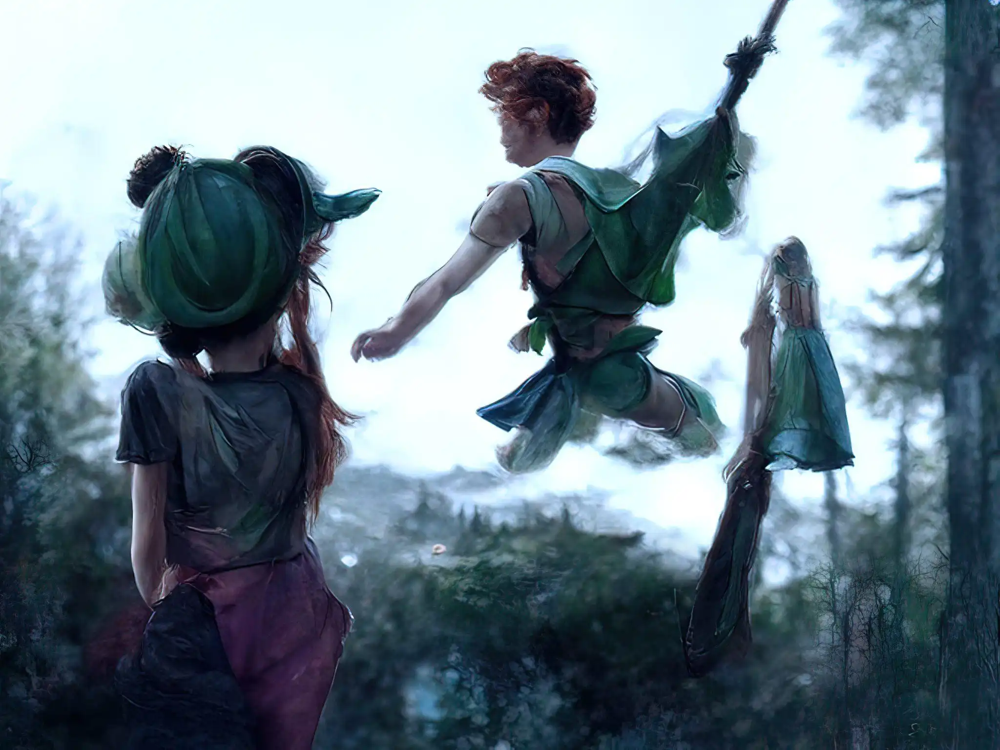{data-gallery="wndrkmr2021"}

- 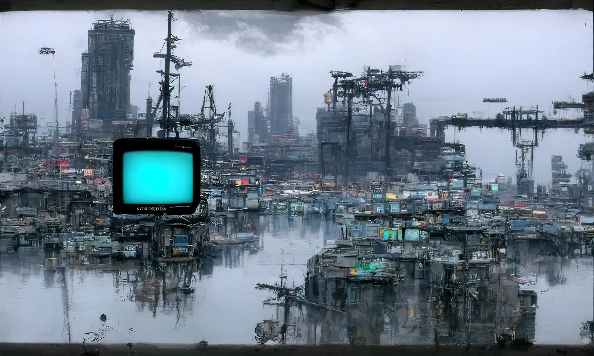{data-gallery="wndrkmr2021"}

