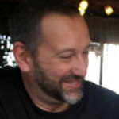

### Bio

<a href="https://hmpg.net/">{ align=left }</a>Sono nato a Pesaro, nel 1963 e sono professore ordinario di "Applicazioni Digitali per l'Arte" presso l'Accademia di Belle Arti "Mario Sironi" di Sassari, dove mi occupo soprattutto di Creatività Computazionale, Arte Generativa e Intelligenza Artificiale e insegno anche Regia per il Teatro d'Opera e di Prosa.

Ho collaborato per diversi anni con Carmelo Bene, studiato Zen Rinzai col Maestro Engaku Taino e realizzato regie, composizioni multimediali, testi teatrali, traduzioni, saggi e racconti.

È tutto qui dentro, insieme a ciò che ho rubato agli autori che mi rischiarano il cammino e a qualche pensiero ozioso che sa di trovar qui un nido bell'e pronto. 

## Contatti

[GitHub](https://github.com/davideriboli) | [Instagram](https://www.instagram.com/davide.riboli/) | [X](https://twitter.com/DavideRiboli)
